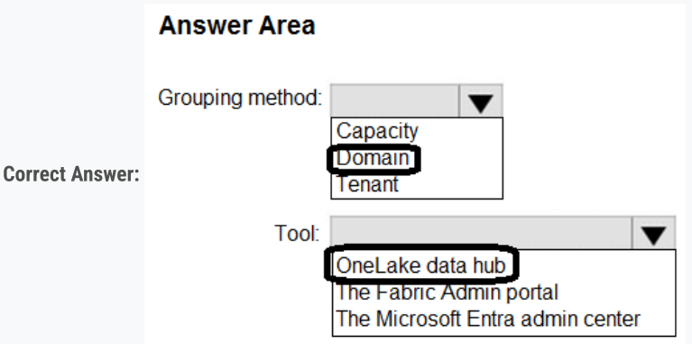
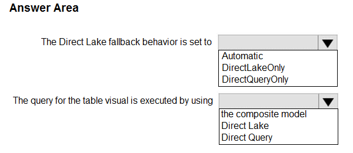

ΞҲΔΜΤΟΡΙΟՏ
- Expert Verified, Online, Free.
 
## Question #1 Topic 1  

Case study -

This is a case study. Case studies are not timed separately. You can use as much exam time as you would like to complete each case. However, there may be additional case studies and sections on this exam. You must manage your time to ensure that you are able to complete all questions included on this exam in the time provided.

To answer the questions included in a case study, you will need to reference information that is provided in the case study. Case studies might contain exhibits and other resources that provide more information about the scenario that is described in the case study. Each question is independent of the other questions in this case study.

At the end of this case study, a review screen will appear. This screen allows you to review your answers and to make changes before you move to the next section of the exam. After you begin a new section, you cannot return to this section.

To display the first question in this case study, click the Next button. Use the buttons in the left pane to explore the content of the case study before you answer the questions. Clicking these buttons displays information such as business requirements, existing environment, and problem statements. If the case study has an All Information tab, note that the information displayed is identical to the information displayed on the subsequent tabs. When you are ready to answer a question, click the Question button to return to the question.

Contoso, Ltd. is a US-based health supplements company. Contoso has two divisions named Sales and Research. The Sales division contains two departments named Online Sales and Retail Sales. The Research division assigns internally developed product lines to individual teams of researchers and analysts.

Existing Environment -

Identity Environment -

Contoso has a Microsoft Entra tenant named contoso.com. The tenant contains two groups named ResearchReviewersGroup1 and ResearchReviewersGroup2.

Data Environment -

Contoso has the following data environment:

The Sales division uses a Microsoft Power BI Premium capacity.

The semantic model of the Online Sales department includes a fact table named Orders that uses Import made. In the system of origin, the OrderID value represents the sequence in which orders are created.

The Research department uses an on-premises, third-party data warehousing product.

Fabric is enabled for contoso.com.

An Azure Data Lake Storage Gen2 storage account named storage1 contains Research division data for a product line named Productline1. The data is in the delta format.

A Data Lake Storage Gen2 storage account named storage2 contains Research division data for a product line named Productline2. The data is in the CSV format.

Requirements -

Planned Changes -

Contoso plans to make the following changes:

Enable support for Fabric in the Power BI Premium capacity used by the Sales division.

Make all the data for the Sales division and the Research division available in Fabric.

For the Research division, create two Fabric workspaces named Productline1ws and Productine2ws.

In Productline1ws, create a lakehouse named Lakehouse1.

In Lakehouse1, create a shortcut to storage1 named ResearchProduct.

Data Analytics Requirements -

Contoso identifies the following data analytics requirements:

All the workspaces for the Sales division and the Research division must support all Fabric experiences.

The Research division workspaces must use a dedicated, on-demand capacity that has per-minute billing. 

The Research division workspaces must be grouped together logically to support OneLake data hub filtering based on the department name.

For the Research division workspaces, the members of ResearchReviewersGroup1 must be able to read lakehouse and warehouse data and shortcuts by using SQL endpoints.

For the Research division workspaces, the members of ResearchReviewersGroup2 must be able to read lakehouse data by using Lakehouse explorer.

All the semantic models and reports for the Research division must use version control that supports branching.

Data Preparation Requirements -

Contoso identifies the following data preparation requirements:

The Research division data for Productline1 must be retrieved from Lakehouse1 by using Fabric notebooks.

All the Research division data in the lakehouses must be presented as managed tables in Lakehouse explorer.

Semantic Model Requirements -

Contoso identifies the following requirements for implementing and managing semantic models:

The number of rows added to the Orders table during refreshes must be minimized.

The semantic models in the Research division workspaces must use Direct Lake mode.

General Requirements -

Contoso identifies the following high-level requirements that must be considered for all solutions:

Follow the principle of least privilege when applicable.

Minimize implementation and maintenance effort when possible.

You need to ensure that Contoso can use version control to meet the data analytics requirements and the general requirements.

What should you do?

A. Store at the semantic models and reports in Data Lake Gen2 storage.

B. Modify the settings of the Research workspaces to use a GitHub repository.

C. Modify the settings of the Research division workspaces to use an Azure Repos repository.

D. Store all the semantic models and reports in Microsoft OneDrive.

```
Correct Answer: B
                 
  Community vote distribution
                             C (96%) 4%

```

## Question \#2 Topic 1 HOTSPOT -

Case study -

This is a case study. Case studies are not timed separately. You can use as much exam time as you would like to complete each case. However, there may be additional case studies and sections on this exam. You must manage your time to ensure that you are able to complete all questions included on this exam in the time provided.

To answer the questions included in a case study, you will need to reference information that is provided in the case study. Case studies might contain exhibits and other resources that provide more information about the scenario that is described in the case study. Each question is independent of the other questions in this case study.

At the end of this case study, a review screen will appear. This screen allows you to review your answers and to make changes before you move to the next section of the exam. After you begin a new section, you cannot return to this section.

To display the first question in this case study, click the Next button. Use the buttons in the left pane to explore the content of the case study before you answer the questions. Clicking these buttons displays information such as business requirements, existing environment, and problem statements. If the case study has an All Information tab, note that the information displayed is identical to the information displayed on the subsequent tabs. When you are ready to answer a question, click the Question button to return to the question.

Contoso, Ltd. is a US-based health supplements company. Contoso has two divisions named Sales and Research. The Sales division contains two departments named Online Sales and Retail Sales. The Research division assigns internally developed product lines to individual teams of researchers and analysts.

Existing Environment -

Identity Environment -

Contoso has a Microsoft Entra tenant named contoso.com. The tenant contains two groups named ResearchReviewersGroup1 and ResearchReviewersGroup2.

Data Environment -

Contoso has the following data environment:

The Sales division uses a Microsoft Power BI Premium capacity.

The semantic model of the Online Sales department includes a fact table named Orders that uses Import made. In the system of origin, the OrderID value represents the sequence in which orders are created.

The Research department uses an on-premises, third-party data warehousing product.

Fabric is enabled for contoso.com.

An Azure Data Lake Storage Gen2 storage account named storage1 contains Research division data for a product line named Productline1. The data is in the delta format.

A Data Lake Storage Gen2 storage account named storage2 contains Research division data for a product line named Productline2. The data is in the CSV format.

Requirements -

Planned Changes -

Contoso plans to make the following changes:

Enable support for Fabric in the Power BI Premium capacity used by the Sales division.

Make all the data for the Sales division and the Research division available in Fabric.

For the Research division, create two Fabric workspaces named Productline1ws and Productine2ws.

In Productline1ws, create a lakehouse named Lakehouse1.

In Lakehouse1, create a shortcut to storage1 named ResearchProduct.

Data Analytics Requirements -

Contoso identifies the following data analytics requirements:

All the workspaces for the Sales division and the Research division must support all Fabric experiences.

The Research division workspaces must use a dedicated, on-demand capacity that has per-minute billing.

The Research division workspaces must be grouped together logically to support OneLake data hub filtering based on the department name. 

For the Research division workspaces, the members of ResearchReviewersGroup1 must be able to read lakehouse and warehouse data and shortcuts by using SQL endpoints.

For the Research division workspaces, the members of ResearchReviewersGroup2 must be able to read lakehouse data by using Lakehouse explorer.

All the semantic models and reports for the Research division must use version control that supports branching.

Data Preparation Requirements -

Contoso identifies the following data preparation requirements:

The Research division data for Productline1 must be retrieved from Lakehouse1 by using Fabric notebooks.

All the Research division data in the lakehouses must be presented as managed tables in Lakehouse explorer.

Semantic Model Requirements -

Contoso identifies the following requirements for implementing and managing semantic models:

The number of rows added to the Orders table during refreshes must be minimized.

The semantic models in the Research division workspaces must use Direct Lake mode.

General Requirements -

Contoso identifies the following high-level requirements that must be considered for all solutions:

Follow the principle of least privilege when applicable.

Minimize implementation and maintenance effort when possible.

You need to recommend a solution to group the Research division workspaces.

What should you include in the recommendation? To answer, select the appropriate options in the answer area.

NOTE: Each correct selection is worth one point.





## Question \#3 Topic 1 
Case study -

This is a case study. Case studies are not timed separately. You can use as much exam time as you would like to complete each case. However, there may be additional case studies and sections on this exam. You must manage your time to ensure that you are able to complete all questions included on this exam in the time provided.

To answer the questions included in a case study, you will need to reference information that is provided in the case study. Case studies might contain exhibits and other resources that provide more information about the scenario that is described in the case study. Each question is independent of the other questions in this case study.

At the end of this case study, a review screen will appear. This screen allows you to review your answers and to make changes before you move to the next section of the exam. After you begin a new section, you cannot return to this section.

To start the case study -

To display the first question in this case study, click the Next button. Use the buttons in the left pane to explore the content of the case study before you answer the questions. Clicking these buttons displays information such as business requirements, existing environment, and problem statements. If the case study has an All Information tab, note that the information displayed is identical to the information displayed on the subsequent tabs. When you are ready to answer a question, click the Question button to return to the question.

Contoso, Ltd. is a US-based health supplements company. Contoso has two divisions named Sales and Research. The Sales division contains two departments named Online Sales and Retail Sales. The Research division assigns internally developed product lines to individual teams of researchers and analysts.

Existing Environment -

Identity Environment -

Contoso has a Microsoft Entra tenant named contoso.com. The tenant contains two groups named ResearchReviewersGroup1 and ResearchReviewersGroup2.

Data Environment -

Contoso has the following data environment:

The Sales division uses a Microsoft Power BI Premium capacity.

The semantic model of the Online Sales department includes a fact table named Orders that uses Import made. In the system of origin, the OrderID value represents the sequence in which orders are created.

The Research department uses an on-premises, third-party data warehousing product.

Fabric is enabled for contoso.com.

An Azure Data Lake Storage Gen2 storage account named storage1 contains Research division data for a product line named Productline1. The data is in the delta format.

A Data Lake Storage Gen2 storage account named storage2 contains Research division data for a product line named Productline2. The data is in the CSV format.

Requirements -

Planned Changes -

Contoso plans to make the following changes:

Enable support for Fabric in the Power BI Premium capacity used by the Sales division.

Make all the data for the Sales division and the Research division available in Fabric.

For the Research division, create two Fabric workspaces named Productline1ws and Productine2ws.

In Productline1ws, create a lakehouse named Lakehouse1.

In Lakehouse1, create a shortcut to storage1 named ResearchProduct.

Data Analytics Requirements -

Contoso identifies the following data analytics requirements:

All the workspaces for the Sales division and the Research division must support all Fabric experiences.

The Research division workspaces must use a dedicated, on-demand capacity that has per-minute billing.

The Research division workspaces must be grouped together logically to support OneLake data hub filtering based on the department name.

For the Research division workspaces, the members of ResearchReviewersGroup1 must be able to read lakehouse and warehouse data and shortcuts by using SQL endpoints. 

For the Research division workspaces, the members of ResearchReviewersGroup2 must be able to read lakehouse data by using Lakehouse explorer.

All the semantic models and reports for the Research division must use version control that supports branching.

Data Preparation Requirements -

Contoso identifies the following data preparation requirements:

The Research division data for Productline1 must be retrieved from Lakehouse1 by using Fabric notebooks.

All the Research division data in the lakehouses must be presented as managed tables in Lakehouse explorer.

Semantic Model Requirements -

Contoso identifies the following requirements for implementing and managing semantic models:

The number of rows added to the Orders table during refreshes must be minimized.

The semantic models in the Research division workspaces must use Direct Lake mode.

General Requirements -

Contoso identifies the following high-level requirements that must be considered for all solutions:

Follow the principle of least privilege when applicable.

Minimize implementation and maintenance effort when possible.

You need to refresh the Orders table of the Online Sales department. The solution must meet the semantic model requirements.

What should you include in the solution?

A. an Azure Data Factory pipeline that executes a Stored procedure activity to retrieve the maximum value of the OrderID column in the destination lakehouse 
B. an Azure Data Factory pipeline that executes a Stored procedure activity to retrieve the minimum value of the OrderID column in the destination lakehouse 
C. an Azure Data Factory pipeline that executes a dataflow to retrieve the minimum value of the OrderID column in the destination lakehouse 
D. an Azure Data Factory pipeline that executes a dataflow to retrieve the maximum value of the OrderID column in the destination lakehouse

```
Correct Answer: D
                 
  Community vote distribution
                      D (73%) A (27%)

```

## Question \#4 Topic 1 
Case study -

This is a case study. Case studies are not timed separately. You can use as much exam time as you would like to complete each case. However, there may be additional case studies and sections on this exam. You must manage your time to ensure that you are able to complete all questions included on this exam in the time provided.

To answer the questions included in a case study, you will need to reference information that is provided in the case study. Case studies might contain exhibits and other resources that provide more information about the scenario that is described in the case study. Each question is independent of the other questions in this case study.

At the end of this case study, a review screen will appear. This screen allows you to review your answers and to make changes before you move to the next section of the exam. After you begin a new section, you cannot return to this section.

To start the case study -

To display the first question in this case study, click the Next button. Use the buttons in the left pane to explore the content of the case study before you answer the questions. Clicking these buttons displays information such as business requirements, existing environment, and problem statements. If the case study has an All Information tab, note that the information displayed is identical to the information displayed on the subsequent tabs. When you are ready to answer a question, click the Question button to return to the question.

Contoso, Ltd. is a US-based health supplements company. Contoso has two divisions named Sales and Research. The Sales division contains two departments named Online Sales and Retail Sales. The Research division assigns internally developed product lines to individual teams of researchers and analysts.

Existing Environment -

Identity Environment -

Contoso has a Microsoft Entra tenant named contoso.com. The tenant contains two groups named ResearchReviewersGroup1 and ResearchReviewersGroup2.

Data Environment -

Contoso has the following data environment:

The Sales division uses a Microsoft Power BI Premium capacity.

The semantic model of the Online Sales department includes a fact table named Orders that uses Import made. In the system of origin, the OrderID value represents the sequence in which orders are created.

The Research department uses an on-premises, third-party data warehousing product.

Fabric is enabled for contoso.com.

An Azure Data Lake Storage Gen2 storage account named storage1 contains Research division data for a product line named Productline1. The data is in the delta format.

A Data Lake Storage Gen2 storage account named storage2 contains Research division data for a product line named Productline2. The data is in the CSV format.

Requirements -

Planned Changes -

Contoso plans to make the following changes:

Enable support for Fabric in the Power BI Premium capacity used by the Sales division.

Make all the data for the Sales division and the Research division available in Fabric.

For the Research division, create two Fabric workspaces named Productline1ws and Productine2ws.

In Productline1ws, create a lakehouse named Lakehouse1.

In Lakehouse1, create a shortcut to storage1 named ResearchProduct.

Data Analytics Requirements -

Contoso identifies the following data analytics requirements:

All the workspaces for the Sales division and the Research division must support all Fabric experiences.

The Research division workspaces must use a dedicated, on-demand capacity that has per-minute billing.

The Research division workspaces must be grouped together logically to support OneLake data hub filtering based on the department name.

For the Research division workspaces, the members of ResearchReviewersGroup1 must be able to read lakehouse and warehouse data and shortcuts by using SQL endpoints. 

For the Research division workspaces, the members of ResearchReviewersGroup2 must be able to read lakehouse data by using Lakehouse explorer.

All the semantic models and reports for the Research division must use version control that supports branching.

Data Preparation Requirements -

Contoso identifies the following data preparation requirements:

The Research division data for Productline1 must be retrieved from Lakehouse1 by using Fabric notebooks.

All the Research division data in the lakehouses must be presented as managed tables in Lakehouse explorer.

Semantic Model Requirements -

Contoso identifies the following requirements for implementing and managing semantic models:

The number of rows added to the Orders table during refreshes must be minimized.

The semantic models in the Research division workspaces must use Direct Lake mode.

General Requirements -

Contoso identifies the following high-level requirements that must be considered for all solutions:

Follow the principle of least privilege when applicable.

Minimize implementation and maintenance effort when possible.

Which syntax should you use in a notebook to access the Research division data for Productline1?

A. spark.read.format("delta").load("Tables/productline1/ResearchProduct")

B. spark.sql("SELECT * FROM Lakehouse1.ResearchProduct ")

C. external_table('Tables/ResearchProduct)

D. external_table(ResearchProduct)

```
Correct Answer: A
                 
  Community vote distribution
                           B (90%) 10%

```

## Question \#5 Hotspot -

Case study -

This is a case study. Case studies are not timed separately. You can use as much exam time as you would like to complete each case. However, there may be additional case studies and sections on this exam. You must manage your time to ensure that you are able to complete all questions included on this exam in the time provided.

To answer the questions included in a case study, you will need to reference information that is provided in the case study. Case studies might contain exhibits and other resources that provide more information about the scenario that is described in the case study. Each question is independent of the other questions in this case study.

At the end of this case study, a review screen will appear. This screen allows you to review your answers and to make changes before you move to the next section of the exam. After you begin a new section, you cannot return to this section.

To display the first question in this case study, click the Next button. Use the buttons in the left pane to explore the content of the case study before you answer the questions. Clicking these buttons displays information such as business requirements, existing environment, and problem statements. If the case study has an All Information tab, note that the information displayed is identical to the information displayed on the subsequent tabs. When you are ready to answer a question, click the Question button to return to the question.

Litware, Inc. is a manufacturing company that has offices throughout North America. The analytics team at Litware contains data engineers, analytics engineers, data analysts, and data scientists.

Existing Environment -

Fabric Environment -

Litware has been using a Microsoft Power BI tenant for three years. Litware has NOT enabled any Fabric capacities and features.

Available Data -

Litware has data that must be analyzed as shown in the following table.

| The Product data contains a single table and the following columns. The customer satisfaction data contains the following tables:   |
|-------------------------------------------------------------------------------------------------------------------------------------|


Survey -

Question -

Response -

For each survey submitted, the following occurs:

One row is added to the Survey table.

One row is added to the Response table for each question in the survey.

The Question table contains the text of each survey question. The third question in each survey response is an overall satisfaction score.

Customers can submit a survey after each purchase.

User Problems -

The analytics team has large volumes of data, some of which is semi-structured. The team wants to use Fabric to create a new data store.

Product data is often classified into three pricing groups: high, medium, and low. This logic is implemented in several databases and semantic models, but the logic does NOT always match across implementations. 

Requirements -

Planned Changes -

Litware plans to enable Fabric features in the existing tenant. The analytics team will create a new data store as a proof of concept (PoC). The remaining Liware users will only get access to the Fabric features once the PoC is complete. The PoC will be completed by using a Fabric trial capacity The following three workspaces will be created:

AnalyticsPOC: Will contain the data store, semantic models, reports pipelines, dataflow, and notebooks used to populate the data store DataEngPOC: Will contain all the pipelines, dataflows, and notebooks used to populate OneLake DataSciPOC: Will contain all the notebooks and reports created by the data scientists The following will be created in the AnalyticsPOC workspace:

A custom semantic model -

A default semantic model -

Interactive reports -

The data engineers will create data pipelines to load data to OneLake either hourly or daily depending on the data source. The analytics engineers will create processes to ingest, transform, and load the data to the data store in the AnalyticsPOC workspace daily. Whenever possible, the data engineers will use low-code tools for data ingestion. The choice of which data cleansing and transformation tools to use will be at the data engineers' discretion.

All the semantic models and reports in the Analytics POC workspace will use the data store as the sole data source.

Technical Requirements -

The data store must support the following:

Read access by using T-SQL or Python Semi-structured and unstructured data Row-level security (RLS) for users executing T-SQL queries Files loaded by the data engineers to OneLake will be stored in the Parquet format and will meet Delta Lake specifications.

Data will be loaded without transformation in one area of the AnalyticsPOC data store. The data will then be cleansed, merged, and transformed into a dimensional model The data load process must ensure that the raw and cleansed data is updated completely before populating the dimensional model The dimensional model must contain a date dimension. There is no existing data source for the date dimension. The Litware fiscal year matches the calendar year. The date dimension must always contain dates from 2010 through the end of the current year.

The product pricing group logic must be maintained by the analytics engineers in a single location. The pricing group data must be made available in the data store for T-SOL. queries and in the default semantic model. The following logic must be used:

List prices that are less than or equal to 50 are in the low pricing group.

List prices that are greater than 50 and less than or equal to 1,000 are in the medium pricing group.

List prices that are greater than 1,000 are in the high pricing group.

Security Requirements -

Only Fabric administrators and the analytics team must be able to see the Fabric items created as part of the PoC.

Litware identifies the following security requirements for the Fabric items in the AnalyticsPOC workspace:

Fabric administrators will be the workspace administrators.

The data engineers must be able to read from and write to the data store. No access must be granted to datasets or reports.

The analytics engineers must be able to read from, write to, and create schemas in the data store. They also must be able to create and share semantic models with the data analysts and view and modify all reports in the workspace.

The data scientists must be able to read from the data store, but not write to it. They will access the data by using a Spark notebook The data analysts must have read access to only the dimensional model objects in the data store. They also must have access to create Power BI

reports by using the semantic models created by the analytics engineers.

The date dimension must be available to all users of the data store.

The principle of least privilege must be followed.

Both the default and custom semantic models must include only tables or views from the dimensional model in the data store. Litware already has the following Microsoft Entra security groups:

FabricAdmins: Fabric administrators A data store (type to be decided)

AnalyticsTeam: All the members of the analytics team DataAnalysts: The data analysts on the analytics team DataScientists: The data scientists on the analytics team DataEngineers: The data engineers on the analytics team AnalyticsEngineers: The analytics engineers on the analytics team Report Requirements -
The data analysts must create a customer satisfaction report that meets the following requirements:
Enables a user to select a product to filter customer survey responses to only those who have purchased that product.

Displays the average overall satisfaction score of all the surveys submitted during the last 12 months up to a selected dat.

Shows data as soon as the data is updated in the data store.

Ensures that the report and the semantic model only contain data from the current and previous year. Ensures that the report respects any table-level security specified in the source data store.

Minimizes the execution time of report queries.

You need to assign permissions for the data store in the AnalyticsPOC workspace. The solution must meet the security requirements. Which additional permissions should you assign when you share the data store? To answer, select the appropriate options in the answer area.

NOTE: Each correct selection is worth one point.

ANSWER AREA:


Correct Answer:


## Question \#6 Hotspot - 

Case study -

This is a case study. Case studies are not timed separately. You can use as much exam time as you would like to complete each case. However, there may be additional case studies and sections on this exam. You must manage your time to ensure that you are able to complete all questions included on this exam in the time provided.

To answer the questions included in a case study, you will need to reference information that is provided in the case study. Case studies might contain exhibits and other resources that provide more information about the scenario that is described in the case study. Each question is independent of the other questions in this case study.

At the end of this case study, a review screen will appear. This screen allows you to review your answers and to make changes before you move to the next section of the exam. After you begin a new section, you cannot return to this section.

To display the first question in this case study, click the Next button. Use the buttons in the left pane to explore the content of the case study before you answer the questions. Clicking these buttons displays information such as business requirements, existing environment, and problem statements. If the case study has an All Information tab, note that the information displayed is identical to the information displayed on the subsequent tabs. When you are ready to answer a question, click the Question button to return to the question.

Litware, Inc. is a manufacturing company that has offices throughout North America. The analytics team at Litware contains data engineers, analytics engineers, data analysts, and data scientists.

Existing Environment -

Fabric Environment -

Litware has been using a Microsoft Power BI tenant for three years. Litware has NOT enabled any Fabric capacities and features.

Available Data -

Litware has data that must be analyzed as shown in the following table.

| The Product data contains a single table and the following columns. The customer satisfaction data contains the following tables:   |
|-------------------------------------------------------------------------------------------------------------------------------------|


Survey -

Question -

Response -

For each survey submitted, the following occurs:

One row is added to the Survey table.

One row is added to the Response table for each question in the survey.

The Question table contains the text of each survey question. The third question in each survey response is an overall satisfaction score.

Customers can submit a survey after each purchase.

User Problems -

The analytics team has large volumes of data, some of which is semi-structured. The team wants to use Fabric to create a new data store.

Product data is often classified into three pricing groups: high, medium, and low. This logic is implemented in several databases and semantic models, but the logic does NOT always match across implementations. 

Requirements -

Planned Changes -

Litware plans to enable Fabric features in the existing tenant. The analytics team will create a new data store as a proof of concept (PoC). The remaining Liware users will only get access to the Fabric features once the PoC is complete. The PoC will be completed by using a Fabric trial capacity The following three workspaces will be created:

AnalyticsPOC: Will contain the data store, semantic models, reports pipelines, dataflow, and notebooks used to populate the data store DataEngPOC: Will contain all the pipelines, dataflows, and notebooks used to populate OneLake DataSciPOC: Will contain all the notebooks and reports created by the data scientists The following will be created in the AnalyticsPOC workspace:

A custom semantic model -

A default semantic model -

Interactive reports -

The data engineers will create data pipelines to load data to OneLake either hourly or daily depending on the data source. The analytics engineers will create processes to ingest, transform, and load the data to the data store in the AnalyticsPOC workspace daily. Whenever possible, the data engineers will use low-code tools for data ingestion. The choice of which data cleansing and transformation tools to use will be at the data engineers' discretion.

All the semantic models and reports in the Analytics POC workspace will use the data store as the sole data source.

Technical Requirements -

The data store must support the following:

Read access by using T-SQL or Python Semi-structured and unstructured data Row-level security (RLS) for users executing T-SQL queries Files loaded by the data engineers to OneLake will be stored in the Parquet format and will meet Delta Lake specifications.

Data will be loaded without transformation in one area of the AnalyticsPOC data store. The data will then be cleansed, merged, and transformed into a dimensional model The data load process must ensure that the raw and cleansed data is updated completely before populating the dimensional model The dimensional model must contain a date dimension. There is no existing data source for the date dimension. The Litware fiscal year matches the calendar year. The date dimension must always contain dates from 2010 through the end of the current year.

The product pricing group logic must be maintained by the analytics engineers in a single location. The pricing group data must be made available in the data store for T-SOL. queries and in the default semantic model. The following logic must be used:

List prices that are less than or equal to 50 are in the low pricing group.

List prices that are greater than 50 and less than or equal to 1,000 are in the medium pricing group.

List prices that are greater than 1,000 are in the high pricing group.

Security Requirements -

Only Fabric administrators and the analytics team must be able to see the Fabric items created as part of the PoC.

Litware identifies the following security requirements for the Fabric items in the AnalyticsPOC workspace:

Fabric administrators will be the workspace administrators.

The data engineers must be able to read from and write to the data store. No access must be granted to datasets or reports.

The analytics engineers must be able to read from, write to, and create schemas in the data store. They also must be able to create and share semantic models with the data analysts and view and modify all reports in the workspace.

The data scientists must be able to read from the data store, but not write to it. They will access the data by using a Spark notebook The data analysts must have read access to only the dimensional model objects in the data store. They also must have access to create Power BI

reports by using the semantic models created by the analytics engineers.

The date dimension must be available to all users of the data store.

The principle of least privilege must be followed.

Both the default and custom semantic models must include only tables or views from the dimensional model in the data store. Litware already has the following Microsoft Entra security groups:

FabricAdmins: Fabric administrators A data store (type to be decided)

AnalyticsTeam: All the members of the analytics team DataAnalysts: The data analysts on the analytics team DataScientists: The data scientists on the analytics team DataEngineers: The data engineers on the analytics team AnalyticsEngineers: The analytics engineers on the analytics team Report Requirements - The data analysts must create a customer satisfaction report that meets the following requirements:
Enables a user to select a product to filter customer survey responses to only those who have purchased that product.

Displays the average overall satisfaction score of all the surveys submitted during the last 12 months up to a selected dat. Shows data as soon as the data is updated in the data store. Ensures that the report and the semantic model only contain data from the current and previous year. Ensures that the report respects any table-level security specified in the source data store. Minimizes the execution time of report queries. You need to create a DAX measure to calculate the average overall satisfaction score. How should you complete the DAX code? To answer, select the appropriate options in the answer area. 

NOTE: Each correct selection is worth one point.

ANSWER AREA:


Correct Answer:


'Survey Question' [Question Title] = "Overall Satisfaction"

## Question \#7 Hotspot -

Case study -

This is a case study. Case studies are not timed separately. You can use as much exam time as you would like to complete each case. However, there may be additional case studies and sections on this exam. You must manage your time to ensure that you are able to complete all questions included on this exam in the time provided.

To answer the questions included in a case study, you will need to reference information that is provided in the case study. Case studies might contain exhibits and other resources that provide more information about the scenario that is described in the case study. Each question is independent of the other questions in this case study.

At the end of this case study, a review screen will appear. This screen allows you to review your answers and to make changes before you move to the next section of the exam. After you begin a new section, you cannot return to this section.

To display the first question in this case study, click the Next button. Use the buttons in the left pane to explore the content of the case study before you answer the questions. Clicking these buttons displays information such as business requirements, existing environment, and problem statements. If the case study has an All Information tab, note that the information displayed is identical to the information displayed on the subsequent tabs. When you are ready to answer a question, click the Question button to return to the question.

Litware, Inc. is a manufacturing company that has offices throughout North America. The analytics team at Litware contains data engineers, analytics engineers, data analysts, and data scientists.

Existing Environment -

Fabric Environment -

Litware has been using a Microsoft Power BI tenant for three years. Litware has NOT enabled any Fabric capacities and features.

Available Data:

Litware has data that must be analyzed as shown in the following table.

| The Product data contains a single table and the following columns. The customer satisfaction data contains the following tables:   |
|-------------------------------------------------------------------------------------------------------------------------------------|

Survey -

Question -

Response -

For each survey submitted, the following occurs:

One row is added to the Survey table.

One row is added to the Response table for each question in the survey.

The Question table contains the text of each survey question. The third question in each survey response is an overall satisfaction score.

Customers can submit a survey after each purchase.

User Problems -

The analytics team has large volumes of data, some of which is semi-structured. The team wants to use Fabric to create a new data store.

Product data is often classified into three pricing groups: high, medium, and low. This logic is implemented in several databases and semantic models, but the logic does NOT always match across implementations. 

Requirements -

Planned Changes -

Litware plans to enable Fabric features in the existing tenant. The analytics team will create a new data store as a proof of concept (PoC). The remaining Liware users will only get access to the Fabric features once the PoC is complete. The PoC will be completed by using a Fabric trial capacity The following three workspaces will be created:

AnalyticsPOC: Will contain the data store, semantic models, reports pipelines, dataflow, and notebooks used to populate the data store DataEngPOC: Will contain all the pipelines, dataflows, and notebooks used to populate OneLake DataSciPOC: Will contain all the notebooks and reports created by the data scientists The following will be created in the AnalyticsPOC workspace:

A custom semantic model -

A default semantic model -

Interactive reports -

The data engineers will create data pipelines to load data to OneLake either hourly or daily depending on the data source. The analytics engineers will create processes to ingest, transform, and load the data to the data store in the AnalyticsPOC workspace daily. Whenever possible, the data engineers will use low-code tools for data ingestion. The choice of which data cleansing and transformation tools to use will be at the data engineers' discretion.

All the semantic models and reports in the Analytics POC workspace will use the data store as the sole data source.

Technical Requirements -

The data store must support the following:

Read access by using T-SQL or Python Semi-structured and unstructured data Row-level security (RLS) for users executing T-SQL queries Files loaded by the data engineers to OneLake will be stored in the Parquet format and will meet Delta Lake specifications.

Data will be loaded without transformation in one area of the AnalyticsPOC data store. The data will then be cleansed, merged, and transformed into a dimensional model The data load process must ensure that the raw and cleansed data is updated completely before populating the dimensional model The dimensional model must contain a date dimension. There is no existing data source for the date dimension. The Litware fiscal year matches the calendar year. The date dimension must always contain dates from 2010 through the end of the current year.

The product pricing group logic must be maintained by the analytics engineers in a single location. The pricing group data must be made available in the data store for T-SOL. queries and in the default semantic model. The following logic must be used:

List prices that are less than or equal to 50 are in the low pricing group.

List prices that are greater than 50 and less than or equal to 1,000 are in the medium pricing group.

List prices that are greater than 1,000 are in the high pricing group.

Security Requirements -

Only Fabric administrators and the analytics team must be able to see the Fabric items created as part of the PoC.

Litware identifies the following security requirements for the Fabric items in the AnalyticsPOC workspace:

Fabric administrators will be the workspace administrators.

The data engineers must be able to read from and write to the data store. No access must be granted to datasets or reports.

The analytics engineers must be able to read from, write to, and create schemas in the data store. They also must be able to create and share semantic models with the data analysts and view and modify all reports in the workspace.

The data scientists must be able to read from the data store, but not write to it. They will access the data by using a Spark notebook The data analysts must have read access to only the dimensional model objects in the data store. They also must have access to create Power BI

reports by using the semantic models created by the analytics engineers.

The date dimension must be available to all users of the data store.

The principle of least privilege must be followed.

Both the default and custom semantic models must include only tables or views from the dimensional model in the data store. Litware already has the following Microsoft Entra security groups:

FabricAdmins: Fabric administrators A data store (type to be decided)

AnalyticsTeam: All the members of the analytics team DataAnalysts: The data analysts on the analytics team DataScientists: The data scientists on the analytics team DataEngineers: The data engineers on the analytics team AnalyticsEngineers: The analytics engineers on the analytics team Report Requirements -

The data analysts must create a customer satisfaction report that meets the following requirements:

Enables a user to select a product to filter customer survey responses to only those who have purchased that product.

Displays the average overall satisfaction score of all the surveys submitted during the last 12 months up to a selected dat.

Shows data as soon as the data is updated in the data store.

Ensures that the report and the semantic model only contain data from the current and previous year.

Ensures that the report respects any table-level security specified in the source data store.

Minimizes the execution time of report queries.

You need to resolve the issue with the pricing group classification.

How should you complete the T-SQL statement? To answer, select the appropriate options in the answer area.

NOTE: Each correct selection is worth one point.

ANSWER AREA:


Correct Answer:


## Question \#8
Case Study -

This is a case study. Case studies are not timed separately. You can use as much exam time as you would like to complete each case. However, there may be additional case studies and sections on this exam. You must manage your time to ensure that you are able to complete all questions included on this exam in the time provided.

To answer the questions included in a case study, you will need to reference information that is provided in the case study. Case studies might contain exhibits and other resources that provide more information about the scenario that is described in the case study. Each question is independent of the other questions in this case study.

At the end of this case study, a review screen will appear. This screen allows you to review your answers and to make changes before you move to the next section of the exam. After you begin a new section, you cannot return to this section.

To display the first question in this case study, click the Next button. Use the buttons in the left pane to explore the content of the case study before you answer the questions. Clicking these buttons displays information such as business requirements, existing environment, and problem statements. If the case study has an All Information tab, note that the information displayed is identical to the information displayed on the subsequent tabs. When you are ready to answer a question, click the Question button to return to the question.

Litware, Inc. is a manufacturing company that has offices throughout North America. The analytics team at Litware contains data engineers, analytics engineers, data analysts, and data scientists.

Existing Environment -

Fabric Environment -

Litware has been using a Microsoft Power BI tenant for three years. Litware has NOT enabled any Fabric capacities and features.

Available Data:

Litware has data that must be analyzed as shown in the following table.

| The Product data contains a single table and the following columns.   |
|-----------------------------------------------------------------------|

The customer satisfaction data contains the following tables:

Survey -

Question -

Response -

For each survey submitted, the following occurs:

One row is added to the Survey table.

One row is added to the Response table for each question in the survey.

The Question table contains the text of each survey question. The third question in each survey response is an overall satisfaction score.

Customers can submit a survey after each purchase.

User Problems -

The analytics team has large volumes of data, some of which is semi-structured. The team wants to use Fabric to create a new data store.

Product data is often classified into three pricing groups: high, medium, and low. This logic is implemented in several databases and semantic models, but the logic does NOT always match across implementations.

Requirements - 

Planned Changes -

Litware plans to enable Fabric features in the existing tenant. The analytics team will create a new data store as a proof of concept (PoC). The remaining Liware users will only get access to the Fabric features once the PoC is complete. The PoC will be completed by using a Fabric trial capacity The following three workspaces will be created:

AnalyticsPOC: Will contain the data store, semantic models, reports pipelines, dataflow, and notebooks used to populate the data store DataEngPOC: Will contain all the pipelines, dataflows, and notebooks used to populate OneLake DataSciPOC: Will contain all the notebooks and reports created by the data scientists The following will be created in the AnalyticsPOC workspace:

A data store (type to be decided)

A custom semantic model -

A default semantic model -

Interactive reports -

The data engineers will create data pipelines to load data to OneLake either hourly or daily depending on the data source. The analytics engineers will create processes to ingest, transform, and load the data to the data store in the AnalyticsPOC workspace daily. Whenever possible, the data engineers will use low-code tools for data ingestion. The choice of which data cleansing and transformation tools to use will be at the data engineers' discretion.

All the semantic models and reports in the Analytics POC workspace will use the data store as the sole data source.

Technical Requirements -

The data store must support the following:

Read access by using T-SQL or Python Semi-structured and unstructured data Row-level security (RLS) for users executing T-SQL queries Files loaded by the data engineers to OneLake will be stored in the Parquet format and will meet Delta Lake specifications.

Data will be loaded without transformation in one area of the AnalyticsPOC data store. The data will then be cleansed, merged, and transformed into a dimensional model The data load process must ensure that the raw and cleansed data is updated completely before populating the dimensional model The dimensional model must contain a date dimension. There is no existing data source for the date dimension. The Litware fiscal year matches the calendar year. The date dimension must always contain dates from 2010 through the end of the current year.

The product pricing group logic must be maintained by the analytics engineers in a single location. The pricing group data must be made available in the data store for T-SOL. queries and in the default semantic model. The following logic must be used:

List prices that are less than or equal to 50 are in the low pricing group.

List prices that are greater than 50 and less than or equal to 1,000 are in the medium pricing group.

List prices that are greater than 1,000 are in the high pricing group.

Security Requirements -

Only Fabric administrators and the analytics team must be able to see the Fabric items created as part of the PoC.

Litware identifies the following security requirements for the Fabric items in the AnalyticsPOC workspace:

Fabric administrators will be the workspace administrators.

The data engineers must be able to read from and write to the data store. No access must be granted to datasets or reports.

The analytics engineers must be able to read from, write to, and create schemas in the data store. They also must be able to create and share semantic models with the data analysts and view and modify all reports in the workspace.

The data scientists must be able to read from the data store, but not write to it. They will access the data by using a Spark notebook The data analysts must have read access to only the dimensional model objects in the data store. They also must have access to create Power BI

reports by using the semantic models created by the analytics engineers.

The date dimension must be available to all users of the data store.

The principle of least privilege must be followed.

Both the default and custom semantic models must include only tables or views from the dimensional model in the data store. Litware already has the following Microsoft Entra security groups:

FabricAdmins: Fabric administrators AnalyticsTeam: All the members of the analytics team DataAnalysts: The data analysts on the analytics team DataScientists: The data scientists on the analytics team DataEngineers: The data engineers on the analytics team AnalyticsEngineers: The analytics engineers on the analytics team Report Requirements -

The data analysts must create a customer satisfaction report that meets the following requirements:

Enables a user to select a product to filter customer survey responses to only those who have purchased that product.

Displays the average overall satisfaction score of all the surveys submitted during the last 12 months up to a selected dat.

Shows data as soon as the data is updated in the data store.

Ensures that the report and the semantic model only contain data from the current and previous year.

Ensures that the report respects any table-level security specified in the source data store.

Minimizes the execution time of report queries.

What should you recommend using to ingest the customer data into the data store in the AnalyticsPOC workspace?

A. a stored procedure 
B. a pipeline that contains a KQL activity 
C. a Spark notebook 
D. a dataflow

Correct Answer: D

Community vote distribution


## Question \#9 Topic 1 

Case Study:

This is a case study. Case studies are not timed separately. You can use as much exam time as you would like to complete each case. However, there may be additional case studies and sections on this exam. You must manage your time to ensure that you are able to complete all questions included on this exam in the time provided.

To answer the questions included in a case study, you will need to reference information that is provided in the case study. Case studies might contain exhibits and other resources that provide more information about the scenario that is described in the case study. Each question is independent of the other questions in this case study.

At the end of this case study, a review screen will appear. This screen allows you to review your answers and to make changes before you move to the next section of the exam. After you begin a new section, you cannot return to this section.

To display the first question in this case study, click the Next button. Use the buttons in the left pane to explore the content of the case study before you answer the questions. Clicking these buttons displays information such as business requirements, existing environment, and problem statements. If the case study has an All Information tab, note that the information displayed is identical to the information displayed on the subsequent tabs. When you are ready to answer a question, click the Question button to return to the question.

Litware, Inc. is a manufacturing company that has offices throughout North America. The analytics team at Litware contains data engineers, analytics engineers, data analysts, and data scientists.

Existing Environment -

Fabric Environment:

Litware has been using a Microsoft Power BI tenant for three years. Litware has NOT enabled any Fabric capacities and features.

Available Data:

Litware has data that must be analyzed as shown in the following table.

| The Product data contains a single table and the following columns.   |
|-----------------------------------------------------------------------|


The customer satisfaction data contains the following tables:

Survey -

Question -

Response -

For each survey submitted, the following occurs:

One row is added to the Survey table.

One row is added to the Response table for each question in the survey.

The Question table contains the text of each survey question. The third question in each survey response is an overall satisfaction score.

Customers can submit a survey after each purchase.

User Problems -

The analytics team has large volumes of data, some of which is semi-structured. The team wants to use Fabric to create a new data store.

Product data is often classified into three pricing groups: high, medium, and low. This logic is implemented in several databases and semantic models, but the logic does NOT always match across implementations.

Requirements - 

Planned Changes -

Litware plans to enable Fabric features in the existing tenant. The analytics team will create a new data store as a proof of concept (PoC). The remaining Liware users will only get access to the Fabric features once the PoC is complete. The PoC will be completed by using a Fabric trial capacity The following three workspaces will be created:

AnalyticsPOC: Will contain the data store, semantic models, reports pipelines, dataflow, and notebooks used to populate the data store DataEngPOC: Will contain all the pipelines, dataflows, and notebooks used to populate OneLake DataSciPOC: Will contain all the notebooks and reports created by the data scientists The following will be created in the AnalyticsPOC workspace:

A data store (type to be decided)

A custom semantic model -

A default semantic model -

Interactive reports -

The data engineers will create data pipelines to load data to OneLake either hourly or daily depending on the data source. The analytics engineers will create processes to ingest, transform, and load the data to the data store in the AnalyticsPOC workspace daily. Whenever possible, the data engineers will use low-code tools for data ingestion. The choice of which data cleansing and transformation tools to use will be at the data engineers' discretion.

All the semantic models and reports in the Analytics POC workspace will use the data store as the sole data source.

Technical Requirements -

The data store must support the following:

Read access by using T-SQL or Python Semi-structured and unstructured data Row-level security (RLS) for users executing T-SQL queries Files loaded by the data engineers to OneLake will be stored in the Parquet format and will meet Delta Lake specifications.

Data will be loaded without transformation in one area of the AnalyticsPOC data store. The data will then be cleansed, merged, and transformed into a dimensional model The data load process must ensure that the raw and cleansed data is updated completely before populating the dimensional model The dimensional model must contain a date dimension. There is no existing data source for the date dimension. The Litware fiscal year matches the calendar year. The date dimension must always contain dates from 2010 through the end of the current year.

The product pricing group logic must be maintained by the analytics engineers in a single location. The pricing group data must be made available in the data store for T-SOL. queries and in the default semantic model. The following logic must be used:

List prices that are less than or equal to 50 are in the low pricing group.

List prices that are greater than 50 and less than or equal to 1,000 are in the medium pricing group.

List prices that are greater than 1,000 are in the high pricing group.

Security Requirements -

Only Fabric administrators and the analytics team must be able to see the Fabric items created as part of the PoC.

Litware identifies the following security requirements for the Fabric items in the AnalyticsPOC workspace:

Fabric administrators will be the workspace administrators.

The data engineers must be able to read from and write to the data store. No access must be granted to datasets or reports.

The analytics engineers must be able to read from, write to, and create schemas in the data store. They also must be able to create and share semantic models with the data analysts and view and modify all reports in the workspace.

The data scientists must be able to read from the data store, but not write to it. They will access the data by using a Spark notebook The data analysts must have read access to only the dimensional model objects in the data store. They also must have access to create Power BI

reports by using the semantic models created by the analytics engineers.

The date dimension must be available to all users of the data store.

The principle of least privilege must be followed.

Both the default and custom semantic models must include only tables or views from the dimensional model in the data store. Litware already has the following Microsoft Entra security groups:

FabricAdmins: Fabric administrators AnalyticsTeam: All the members of the analytics team DataAnalysts: The data analysts on the analytics team DataScientists: The data scientists on the analytics team DataEngineers: The data engineers on the analytics team AnalyticsEngineers: The analytics engineers on the analytics team

Report Requirements:

The data analysts must create a customer satisfaction report that meets the following requirements:

Enables a user to select a product to filter customer survey responses to only those who have purchased that product.

Displays the average overall satisfaction score of all the surveys submitted during the last 12 months up to a selected dat.

Shows data as soon as the data is updated in the data store.

Ensures that the report and the semantic model only contain data from the current and previous year.

Ensures that the report respects any table-level security specified in the source data store.

Minimizes the execution time of report queries.

Which type of data store should you recommend in the AnalyticsPOC workspace?

A. a data lake 
B. a warehouse 
C. a lakehouse 
D. an external Hive metastore

```
Correct Answer: C
                 
  Community vote distribution
                              C (100%)


```
## Question /#10 
You have a Fabric warehouse that contains a table named Staging.Sales. Staging.Sales contains the following columns.

| Name           | Data type     |     |
|----------------|---------------|-----|
| ProductID      | Integer       | No  |
| ProductName    | Varchar(30)   | No  |
| SalesDate      | Datetime2(6)  | No  |
| WholesalePrice | Decimal(18,2) | Yes |
| Amount         | Decimal(18,2) | Yes |

You need to write a T-SQL query that will return data for the year 2023 that displays ProductID and ProductName and has a summarized Amount that is higher than 10,000. 

Which query should you use?

A) SELECT ProductID, ProductName, SUM(Amount) AS TotalAmount 
  FROM Staging.Sales A. WHERE DATEPART(YEAR,SaleDate) = '2023' 
  GROUP BY ProductID, ProductName HAVING SUM(Amount) > 10000 
B) SELECT ProductID, ProductName, SUM(Amount) AS TotalAmount 
  FROM Staging.Sales 
  GROUP BY ProductID, ProductName 
  HAVING DATEPART(YEAR,SaleDate) = '2023' AND SUM(Amount) > 10000 
C) SELECT ProductID, ProductName, SUM(Amount) AS TotalAmount  
  FROM Staging.Sales 
  WHERE DATEPART(YEAR,SaleDate) = '2023' AND SUM(Amount) > 10000 
D) SELECT ProductID, ProductName, SUM(Amount) AS TotalAmount 
  FROM Staging.Sales D. WHERE DATEPART(YEAR,SaleDate) = '2023' 
  GROUP BY ProductID, ProductName HAVING TotalAmount > 10000 
  
Correct Answer: A
Community vote distribution

| A (100%)   |
|------------|


## Question \#11 Topic 1 HOTSPOT -
You have a data warehouse that contains a table named Stage.Customers. Stage.Customers contains all the customer record updates from a customer relationship management (CRM) system. There can be multiple updates per customer.

You need to write a T-SQL query that will return the customer ID, name. postal code, and the last updated time of the most recent row for each customer ID.

How should you complete the code? To answer, select the appropriate options in the answer area. 

NOTE: Each correct selection is worth one point.
ANSWER AREA:


Correct Answer: 
Box 1: ROW_NUMBER()
Box 2: WHERE X = 1

## Question \#12 Topic 1 HOTSPOT -

You have a Fabric tenant.

You plan to create a Fabric notebook that will use Spark DataFrames to generate Microsoft Power BI visuals.

You run the following code.


For each of the following statements, select Yes if the statement is true. Otherwise, select No.

NOTE: Each correct selection is worth one point.
ANSWER AREA:

Correct Answer:


## Question \#13
You are the administrator of a Fabric workspace that contains a lakehouse named Lakehouse1. Lakehouse1 contains the following tables:

Table1: A Delta table created by using a shortcut Table2: An external table created by using Spark

| Correct Answer:   |
|-------------------|

Table3: A managed table -

You plan to connect to Lakehouse1 by using its SQL endpoint.

What will you be able to do after connecting to Lakehouse1?

A. Read Table3.

B. Update the data Table3.

C. Read Table2.

D. Update the data in Table1.

Correct Answer: D

Community vote distribution


## Question \#14 Topic 1 
You have a Fabric tenant that contains a warehouse.

You use a dataflow to load a new dataset from OneLake to the warehouse.

You need to add a PowerQuery step to identify the maximum values for the numeric columns.

Which function should you include in the step?

| A. Table.MaxN   |
|-----------------|

| B. Table.Max   |
|----------------|

| C. Table.Range   |
|------------------|

D. Table.Profile

```
Correct Answer: B
                 
  Community vote distribution
                D (56%) B (41%)

```
## Question \#15

You have a Fabric tenant that contains a machine learning model registered in a Fabric workspace.

You need to use the model to generate predictions by using the PREDICT function in a Fabric notebook.

Which two languages can you use to perform model scoring? Each correct answer presents a complete solution.

NOTE: Each correct answer is worth one point.

| A. T-SQL   |
|------------|

| B. DAX   |
|----------|

| C. Spark SQL   |
|----------------|

| D. PySpark |
|------------|
```
Correct Answer: CD
                  
  Community vote distribution
                            CD (95%) 5%

```

## Question \#16 Topic 1 
You are analyzing the data in a Fabric notebook.

You have a Spark DataFrame assigned to a variable named df.

You need to use the Chart view in the notebook to explore the data manually.

Which function should you run to make the data available in the Chart view?

A. displayHTML

B. show C. write D. display

Correct Answer: D

Community vote distribution


## Question \#17
You have a Fabric tenant that contains a Microsoft Power BI report named Report1. Report1 includes a Python visual.

Data displayed by the visual is grouped automatically and duplicate rows are NOT displayed.

You need all rows to appear in the visual.

What should you do?

A. Reference the columns in the Python code by index.

B. Modify the Sort Column By property for all columns.

C. Add a unique field to each row.

D. Modify the Summarize By property for all columns.

```
Correct Answer: A
                 
  Community vote distribution
               C (51%) D (30%) A (19%)

```
## Question 18

DRAG DROP -

You have a Fabric tenant that contains a semantic model. The model contains data about retail stores.

You need to write a DAX query that will be executed by using the XMLA endpoint. The query must return a table of stores that have opened since December 1, 2023.

How should you complete the DAX expression? To answer, drag the appropriate values to the correct targets. Each value may be used once, more than once, or not at all. You may need to drag the split bar between panes or scroll to view content.

NOTE: Each correct selection is worth one point.


Correct Answer:


## Question \#19 Topic 1 
You have a Fabric workspace named Workspace1 that contains a dataflow named Dataflow1. Dataflow1 has a query that returns 2,000 rows.

You view the query in Power Query as shown in the following exhibit.
 


Column statistics Count Error count Null count Distinct count Unique count NaN count


What can you identify about the pickupLongitude column?

A. The column has duplicate values. B. All the table rows are profiled.

C. The column has missing values.

D. There are 935 values that occur only once.

Correct Answer: A
Community vote distribution A (100%)

## Question \#20
You have a Fabric tenant named Tenant1 that contains a workspace named WS1. WS1 uses a capacity named C1 and contains a dataset named DS1.

You need to ensure read-write access to DS1 is available by using XMLA endpoint.

What should be modified first?

A. the DS1 settings 
B. the WS1 settings 
C. the C1 settings 
D. the Tenant1 settings 

Correct Answer: C
Community vote distribution


## Question \#21 
You have a Fabric tenant that contains a workspace named Workspace1. Workspace1 is assigned to a Fabric capacity.

You need to recommend a solution to provide users with the ability to create and publish custom Direct Lake semantic models by using external tools. The solution must follow the principle of least privilege.

Which three actions in the Fabric Admin portal should you include in the recommendation? Each correct answer presents part of the solution.

NOTE: Each correct answer is worth one point.

A. From the Tenant settings, set Allow XMLA Endpoints and Analyze in Excel with on-premises datasets to Enabled.

B. From the Tenant settings, set Allow Azure Active Directory guest users to access Microsoft Fabric to Enabled.

C. From the Tenant settings, select Users can edit data model in the Power BI service.

D. From the Capacity settings, set XMLA Endpoint to Read Write.

E. From the Tenant settings, set Users can create Fabric items to Enabled.

F. From the Tenant settings, enable Publish to Web.

```
Correct Answer: ACD
                    
  Community vote distribution
                       ADE (79%) 13% 8%

```
## Question \#22
You are creating a semantic model in Microsoft Power BI Desktop.

You plan to make bulk changes to the model by using the Tabular Model Definition Language (TMDL) extension for Microsoft Visual Studio Code.

You need to save the semantic model to a file.

Which file format should you use?

| A. PBIP 
  B. PBIX 
  C. PBIT 
  D. PBIDS   |
|------------------------------------|

```
Correct Answer: B
                 
  Community vote distribution
                         A (83%) C (17%)

```

## Question \#23 Topic 1 HOTSPOT -

You have a Fabric tenant that contains a warehouse named Warehouse1. Warehouse1 contains three schemas named schemaA, schemaB, and schemaC.

You need to ensure that a user named User1 can truncate tables in schemaA only.

How should you complete the T-SQL statement? To answer, select the appropriate options in the answer area.

NOTE: Each correct selection is worth one point.
ANSWER AREA:


CORRECT ANSWER:


## Question \#24
You plan to deploy Microsoft Power BI items by using Fabric deployment pipelines. You have a deployment pipeline that contains three stages named Development, Test, and Production. A workspace is assigned to each stage.

You need to provide Power BI developers with access to the pipeline. The solution must meet the following requirements:

Ensure that the developers can deploy items to the workspaces for Development and Test.

Prevent the developers from deploying items to the workspace for Production.

Follow the principle of least privilege.

Which three levels of access should you assign to the developers? Each correct answer presents part of the solution.

NOTE: Each correct answer is worth one point.

A. Build permission to the production semantic models 
B. Admin access to the deployment pipeline 
C. Viewer access to the Development and Test workspaces 
D. Viewer access to the Production workspace 
E. Contributor access to the Development and Test workspaces 
F. Contributor access to the Production workspace

```
Correct Answer: ADE
                   
  Community vote distribution
                        BDE (82%) Other

```

## Question \#25 Topic 1 
You have a Fabric workspace that contains a DirectQuery semantic model. The model queries a data source that has 500 million rows.

You have a Microsoft Power Bi report named Report1 that uses the model. Report1 contains visuals on multiple pages.

You need to reduce the query execution time for the visuals on all the pages.

What are two features that you can use? Each correct answer presents a complete solution, NOTE: Each correct answer is worth one point.

A. user-defined aggregations 
B. automatic aggregation 
C. query caching 
D. OneLake integration

```
Correct Answer: BD
                  
  Community vote distribution
                       AB (80%) 13% 7%

```
## Question \#26
You have a Fabric tenant that contains 30 CSV files in OneLake. The files are updated daily.

You create a Microsoft Power BI semantic model named Model1 that uses the CSV files as a data source. You configure incremental refresh for Model1 and publish the model to a Premium capacity in the Fabric tenant.

When you initiate a refresh of Model1, the refresh fails after running out of resources.

What is a possible cause of the failure?

A. Query folding is occurring.

B. Only refresh complete days is selected.

C. XMLA Endpoint is set to Read Only.

D. Query folding is NOT occurring.

E. The delta type of the column used to partition the data has changed.

Correct Answer: D

Community vote distribution

D (62%) E (27%) 5%

## Question \#27
You have a Fabric tenant that uses a Microsoft Power BI Premium capacity.

You need to enable scale-out for a semantic model.

What should you do first?

| A. At the semantic model level, set Large dataset storage format to Off.   |
|----------------------------------------------------------------------------|

| B. At the tenant level, set Create and use Metrics to Enabled.   |
|------------------------------------------------------------------|

C. At the semantic model level, set Large dataset storage format to On.

D. At the tenant level, set Data Activator to Enabled.

```
Correct Answer: C
                 
  Community vote distribution
                              C (100%)

```
## Question \#28
You have a Fabric tenant that contains a warehouse. The warehouse uses row-level security (RLS).

You create a Direct Lake semantic model that uses the Delta tables and RLS of the warehouse.

When users interact with a report built from the model, which mode will be used by the DAX queries?

A. DirectQuery 
B. Dual 
C. Direct Lake 
D. Import

```
Correct Answer: D
                 
  Community vote distribution
                   C (65%) A (35%)

```
## Question \#29 
You have a Fabric tenant that contains a complex semantic model. The model is based on a star schema and contains many tables, including a fact table named Sales.

You need to create a diagram of the model. The diagram must contain only the Sales table and related tables.

What should you use from Microsoft Power BI Desktop?

A. data categories 
B. Data view 
C. Model view 
D. DAX query view

```
Correct Answer: C
                 
  Community vote distribution
                              C (100%)

```

## Question \#30 Topic 1 
You have a Fabric tenant that contains a semantic model. The model uses Direct Lake mode.

You suspect that some DAX queries load unnecessary columns into memory.

You need to identify the frequently used columns that are loaded into memory.

What are two ways to achieve the goal? Each correct answer presents a complete solution.

NOTE: Each correct answer is worth one point.

A. Use the Analyze in Excel feature.

B. Use the Vertipaq Analyzer tool.

C. Query the $System.DISCOVER_STORAGE_TABLE_COLUMN_SEGMENTS dynamic management view (DMV).

D. Query the DISCOVER_MEMORYGRANT dynamic management view (DMV).

```
Correct Answer: AC
                  
  Community vote distribution
                             BC (100%)

```

## Question \#31 Topic 1 HOTSPOT -
You have the source data model shown in the following exhibit.


The primary keys of the tables are indicated by a key symbol beside the columns involved in each key.

You need to create a dimensional data model that will enable the analysis of order items by date, product, and customer.

What should you include in the solution? To answer, select the appropriate options in the answer area. 
NOTE: Each correct selection is worth one point.

ANSWER AREA

Correct Answer:


## Question \#32 

You have a Fabric tenant that contains a semantic model named Model1. Model1 uses Import mode. Model1 contains a table named Orders.

Orders has 100 million rows and the following fields.

You need to reduce the memory used by Model1 and the time it takes to refresh the model.

Which two actions should you perform? Each correct answer presents part of the solution.

NOTE: Each correct answer is worth one point.

A. Split OrderDateTime into separate date and time columns.

B. Replace TotalQuantity with a calculated column.

C. Convert Quantity into the Text data type.

D. Replace TotalSalesAmount with a measure.

```
Correct Answer: BD
                  
  Community vote distribution
                             AD (100%)

```

## Question #33 Topic 1

You have a Fabric tenant that contains a semantic model.

You need to prevent report creators from populating visuals by using implicit measures.

What are two tools that you can use to achieve the goal? Each correct answer presents a complete solution.

NOTE: Each correct answer is worth one point.

A. Microsoft Power BI Desktop B. Tabular Editor C. Microsoft SQL Server Management Studio (SSMS)

D. DAX Studio

```
Correct Answer: AC
                  
  Community vote distribution
                             AB (100%)

```

## Question #34  Topic 1 HOTSPOT -
You have a Fabric tenant that contains two lakehouses.

You are building a dataflow that will combine data from the lakehouses. The applied steps from one of the queries in the dataflow is shown in the following exhibit.


Use the drop-down menus to select the answer choice that completes each statement based on the information presented in the graphic.
NOTE: Each correct selection is worth one point.


Answer Area


Correct Answer


## Question \#35 Topic 1 
You have a Fabric tenant that contains a lakehouse named Lakehouse'. Lakehouse1 contains a table named Tablet.

You are creating a new data pipeline.

You plan to copy external data to Table'. The schema of the external data changes regularly.

You need the copy operation to meet the following requirements:

Replace Table1 with the schema of the external data.

Replace all the data in Table1 with the rows in the external data.

You add a Copy data activity to the pipeline.

What should you do for the Copy data activity?

A. From the Source tab, add additional columns.

B. From the Destination tab, set Table action to Overwrite.

C. From the Settings tab, select Enable staging.

D. From the Source tab, select Enable partition discovery.

E. From the Source tab, select Recursively.

```
Correct Answer: B
                 
  Community vote distribution
                              B (100%)

```
## Question \#36 Topic 1
You have a Fabric tenant that contains a lakehouse.

You plan to query sales data files by using the SQL endpoint. The files will be in an Amazon Simple Storage Service (Amazon S3) storage bucket.

You need to recommend which file format to use and where to create a shortcut.

Which two actions should you include in the recommendation? Each correct answer presents part of the solution.

NOTE: Each correct answer is worth one point.

A. Create a shortcut in the Files section.

B. Use the Parquet format C. Use the CSV format.

D. Create a shortcut in the Tables section.

E. Use the delta format.

Correct Answer: CD

Community vote distribution

DE (54%) BD (46%)

## Question \#37 Topic 1 
You have a Fabric tenant that contains a lakehouse named Lakehouse1. Lakehouse1 contains a subfolder named Subfolder1 that contains CSV

files.

You need to convert the CSV files into the delta format that has V-Order optimization enabled.

What should you do from Lakehouse explorer?

A. Use the Load to Tables feature.

B. Create a new shortcut in the Files section.

C. Create a new shortcut in the Tables section.

D. Use the Optimize feature.

```
Correct Answer: A
                 
  Community vote distribution
                             A (95%) 5%

```
## Question \#38 Topic 1
You have a Fabric tenant that contains a lakehouse named Lakehouse1. Lakehouse1 contains an unpartitioned table named Table1.

You plan to copy data to Table1 and partition the table based on a date column in the source data.

You create a Copy activity to copy the data to Table1.

You need to specify the partition column in the Destination settings of the Copy activity.

What should you do first?

A. From the Destination tab, set Mode to Append.

B. From the Destination tab, select the partition column.

C. From the Source tab, select Enable partition discovery.

D. From the Destination tabs, set Mode to Overwrite.

```
Correct Answer: D
                 
  Community vote distribution
                         D (82%) Other

```

## Question \#39 Topic 1 HOTSPOT -

You have a Fabric tenant that contains a warehouse named Warehouse1. Warehouse1 contains a fact table named FactSales that has one billion rows.

You run the following T-SQL statement.

CREATE TABLE test.FactSales AS CLONE OF Dbo.FactSales; For each of the following statements, select Yes if the statement is true. Otherwise, select No.

NOTE: Each correct selection is worth one point.

Correct Answer:


## Question \#40  
You have source data in a folder on a local computer.

You need to create a solution that will use Fabric to populate a data store. The solution must meet the following requirements:

Support the use of dataflows to load and append data to the data store.

Ensure that Delta tables are V-Order optimized and compacted automatically.

Which type of data store should you use?
A. a lakehouse
B. an Azure SQL database 
C. a warehouse 
D. a KQL database

```
Correct Answer: C
                 
  Community vote distribution
                    A (68%) C (32%)

```

## Question \#41 Topic 1

You have a Fabric tenant that contains a lakehouse. 
You are using a Fabric notebook to save a large DataFrame by using the following code. df.write.partitionBy("year", "month", "day").mode("overwrite").parquet("Files/SalesOrder")
For each of the following statements, select Yes if the statement is true. Otherwise, select No.

NOTE: Each correct selection is worth one point.
ANSWER AREA
 

Correct Answer:
 

## Question \#42 Topic 1 
You have a Fabric workspace named Workspace1 that contains a data flow named Dataflow1 contains a query that returns the data shown in the


You need to transform the data columns into attribute-value pairs, where columns become rows. You select the VendorID column. Which transformation should you select from the context menu of the VendorID column?

A. Group by 
B. Unpivot columns 
C. Unpivot other columns 
D. Split column 
E. Remove other columns 

Correct Answer: C
Community vote distribution C (100%)

## Question \#43 Topic 1
You have a Fabric tenant that contains a data pipeline.

You need to ensure that the pipeline runs every four hours on Mondays and Fridays.

To what should you set Repeat for the schedule?

A. Daily 
B. By the minute 
C. Weekly 
D. Hourly 

Correct Answer: D
Community vote distribution C (97%)


## Question \#44 Topic 1 
You have a Fabric tenant that contains a warehouse.

Several times a day, the performance of all warehouse queries degrades. You suspect that Fabric is throttling the compute used by the warehouse.

What should you use to identify whether throttling is occurring?

A. the Capacity settings 
B. the Monitoring hub 
C. dynamic management views (DMVs)
D. the Microsoft Fabric Capacity Metrics app

```
Correct Answer: D
                 
  Community vote distribution
                              D (100%)


```

## Question \#45 HOTSPOT -
Topic 1 You have a Fabric workspace that uses the default Spark starter pool and runtime version 1.2. You plan to read a CSV file named Sales_raw.csv in a lakehouse, select columns, and save the data as a Delta table to the managed area of the lakehouse. Sales_raw.csv contains 12 columns.

You have the following code.

from pyspark.sql.functions import year
(spark
.red
.format("csv") .option("heade", 'true') .load("Files/sales_raw.csv") .select('SalesOrderNumber', 'OrderDate', 'CustomerName',
'UnitPrice')
.withColumn("Year", year("OrderDate"))
.write .partitionBy('Year')
.saveAsTable("sales")
For each of the following statements, select Yes if the statement is true. Otherwise, select No.

NOTE: Each correct selection is worth one point.
ANSWER AREA


 Correct Answer:
 


## Question #46

Topic 1 You have a Fabric tenant that contains a warehouse.

A user discovers that a report that usually takes two minutes to render has been running for 45 minutes and has still not rendered. 
You need to identify what is preventing the report query from completing. Which dynamic management view (DMV) should you use?

A. sys.dm_exec_requests 
B. sys.dm_exec_sessions 
C. sys.dm_exec_connections 
D. sys.dm_pdw_exec_requests 

Correct Answer: D
Community vote distribution A (93%) 7%

## Question \#47 
DRAG DROP - You are creating a data flow in Fabric to ingest data from an Azure SQL database by using a T-SQL statement. You need to ensure that any foldable Power Query transformation steps are processed by the Microsoft SQL Server engine.

How should you complete the code? To answer, drag the appropriate values to the correct targets. Each value may be used once, more than once, or not at all. You may need to drag the split bar between panes or scroll to view content.

NOTE: Each correct selection is worth one point.
ANSWER AREA

 
Correct Answer:


## Question \#48 Topic 1 
DRAG DROP - You have a Fabric tenant that contains a lakehouse named Lakehouse1.

Readings from 100 loT devices are appended to a Delta table in Lakehouse1. Each set of readings is approximately 25 KB. Approximately 10 GB of data is received daily. All the table and SparkSession settings are set to the default. You discover that queries are slow to execute. In addition, the lakehouse storage contains data and log files that are no longer used.

You need to remove the files that are no longer used and combine small files into larger files with a target size of 1 GB per file.

What should you do? To answer, drag the appropriate actions to the correct requirements. Each action may be used once, more than once, or not at all. You may need to drag the split bar between panes or scroll to view content. 
NOTE: Each correct selection is worth one point.


Correct answer:


## Question \#49 Topic 1
You need to create a data loading pattern for a Type 1 slowly changing dimension (SCD).

Which two actions should you include in the process? Each correct answer presents part of the solution.

NOTE: Each correct answer is worth one point.

A. Update rows when the non-key attributes have changed.

B. Insert new rows when the natural key exists in the dimension table, and the non-key attribute values have changed.

C. Update the effective end date of rows when the non-key attribute values have changed.

D. Insert new records when the natural key is a new value in the table.

```
Correct Answer: AC
                  
  Community vote distribution
                             AD (100%)

```

## Question \#50 HOTSPOT -

You have a Fabric workspace named Workspace1 and an Azure Data Lake Storage Gen2 account named storage1. Workspace1 contains a lakehouse named Lakehouse1.

You need to create a shortcut to storage1 in Lakehouse1.

Which connection and endpoint should you specify? To answer, select the appropriate options in the answer area.

NOTE: Each correct selection is worth one point.


Correct Answer: 
Box 1: abfss -
Box 2: dfs 

## Question \#51 Topic 1 
You are analyzing customer purchases in a Fabric notebook by using PySpark.

You have the following DataFrames:

transactions: Contains five columns named transaction_id, customer_id, product_id, amount, and date and has 10 million rows, with each row representing a transaction. customers: Contains customer details in 1,000 rows and three columns named customer_id, name, and country.

You need to join the DataFrames on the customer_id column. The solution must minimize data shuffling.

You write the following code.

from pyspark.sql import functions as F

results =

Which code should you run to populate the results DataFrame?

A. transactions.join(F.broadcast(customers), transactions.customer_id == customers.customer_id)

B. transactions.join(customers, transactions.customer_id == customers.customer_id).distinct()

C. transactions.join(customers, transactions.customer_id == customers.customer_id)

D. transactions.crossJoin(customers).where(transactions.customer_id == customers.customer_id)

Correct Answer: A

Community vote distribution


## Question \#52 HOTSPOT 
You have a Microsoft Power BI report and a semantic model that uses Direct Lake mode. From Power BI Desktop, you open Performance analyzer as shown in the following exhibit.


 
Use the drop-down menus to select the answer choice that completes each statement based on the information presented in the graphic.

NOTE: Each correct selection is worth one point.
ANSWER AREA


Correct Answer:


## Question \#53 Hotspot -

You have a Fabric tenant that contains a lakehouse named Lakehouse1. Lakehouse1 contains a table named Nyctaxi_raw. Nyctaxi_row contains the following table:

| Name           | Data type   |
|----------------|-------------|
| pickupDateTime | Timestamp   |
| passengerCount | Integer     |
| fareAmount     | Double      |
| paymentType    | String      |
| tipAmount      | Double      |

You create a Fabric notebook and attach it to Lakehouse1.

You need to use PySpark code to transform the data. The solution must meet the following requirements:
Add a column named pickupDate that will contain only the date portion of pickupDateTime.

Filter the DataFrame to include only rows where fareAmount is a positive number that is less than 100.

How should you complete the code? To answer, select the appropriate options in the answer area. 

NOTE: Each correct selection is worth one point.


Correct Answer:


## Question \#54 Topic 1
Note: This question is part of a series of questions that present the same scenario. Each question in the series contains a unique solution that might meet the stated goals. Some question sets might have more than one correct solution, while others might not have a correct solution.

After you answer a question in this section, you will NOT be able to return to it. As a result, these questions will not appear in the review screen.

You have a Fabric tenant that contains a new semantic model in OneLake.

You use a Fabric notebook to read the data into a Spark DataFrame.

You need to evaluate the data to calculate the min, max, mean, and standard deviation values for all the string and numeric columns.

Solution: You use the following PySpark expression:

df.explain()

Does this meet the goal?

A. Yes
B. No 

```
Correct Answer: B
                 
  Community vote distribution
                              B (100%)

```
## Question \#55 Topic 1
Note: This question is part of a series of questions that present the same scenario. Each question in the series contains a unique solution that might meet the stated goals. Some question sets might have more than one correct solution, while others might not have a correct solution.

After you answer a question in this section, you will NOT be able to return to it. As a result, these questions will not appear in the review screen.

You have a Fabric tenant that contains a new semantic model in OneLake.

You use a Fabric notebook to read the data into a Spark DataFrame.

You need to evaluate the data to calculate the min, max, mean, and standard deviation values for all the string and numeric columns.

Solution: You use the following PySpark expression:

df.show()

Does this meet the goal?
A. Yes
B. No 

```
Correct Answer: B
                 
  Community vote distribution
                              B (100%)

```
## Question \#56 Topic 1

Note: This question is part of a series of questions that present the same scenario. Each question in the series contains a unique solution that might meet the stated goals. Some question sets might have more than one correct solution, while others might not have a correct solution.

After you answer a question in this section, you will NOT be able to return to it. As a result, these questions will not appear in the review screen.

You have a Fabric tenant that contains a new semantic model in OneLake.

You use a Fabric notebook to read the data into a Spark DataFrame.

You need to evaluate the data to calculate the min, max, mean, and standard deviation values for all the string and numeric columns.

Solution: You use the following PySpark expression:

df.summary()

Does this meet the goal?

A. Yes
B. No 


```
Correct Answer: A
                 
  Community vote distribution
                       A (78%) B (22%)


```
## QUESTION \#57 Topic 1
Note: This question is part of a series of questions that present the same scenario. Each question in the series contains a unique solution that might meet the stated goals. Some question sets might have more than one correct solution, while others might not have a correct solution.

After you answer a question in this section, you will NOT be able to return to it. As a result, these questions will not appear in the review screen.

You have a Fabric tenant that contains a lakehouse named Lakehouse1. Lakehouse1 contains a Delta table named Customer.

When you query Customer, you discover that the query is slow to execute. You suspect that maintenance was NOT performed on the table.

You need to identify whether maintenance tasks were performed on Customer.

Solution: You run the following Spark SQL statement:

DESCRIBE HISTORY customer -

Does this meet the goal?

A. Yes
B. No 

```
Correct Answer: A
                 
  Community vote distribution
                              A (100%)

```
## Question \#58 
Note: This question is part of a series of questions that present the same scenario. Each question in the series contains a unique solution that might meet the stated goals. Some question sets might have more than one correct solution, while others might not have a correct solution.

After you answer a question in this section, you will NOT be able to return to it. As a result, these questions will not appear in the review screen.

You have a Fabric tenant that contains a lakehouse named Lakehouse1. Lakehouse1 contains a Delta table named Customer.

When you query Customer, you discover that the query is slow to execute. You suspect that maintenance was NOT performed on the table.

You need to identify whether maintenance tasks were performed on Customer.

Solution: You run the following Spark SQL statement:

REFRESH TABLE customer -

Does this meet the goal?

A. Yes
B. No 

Correct Answer: B

Community vote distribution


## Question \#59 
Note: This question is part of a series of questions that present the same scenario. Each question in the series contains a unique solution that might meet the stated goals. Some question sets might have more than one correct solution, while others might not have a correct solution.

After you answer a question in this section, you will NOT be able to return to it. As a result, these questions will not appear in the review screen.

You have a Fabric tenant that contains a lakehouse named Lakehouse1. Lakehouse1 contains a Delta table named Customer.

When you query Customer, you discover that the query is slow to execute. You suspect that maintenance was NOT performed on the table.

You need to identify whether maintenance tasks were performed on Customer.

Solution: You run the following Spark SQL statement:

EXPLAIN TABLE customer -

Does this meet the goal?
A. Yes
B. No 
```
Correct Answer: B
                 
  Community vote distribution
                              B (100%)

```

## Question \#60 
Case study -

This is a case study. Case studies are not timed separately. You can use as much exam time as you would like to complete each case. However, there may be additional case studies and sections on this exam. You must manage your time to ensure that you are able to complete all questions included on this exam in the time provided.

To answer the questions included in a case study, you will need to reference information that is provided in the case study. Case studies might contain exhibits and other resources that provide more information about the scenario that is described in the case study. Each question is independent of the other questions in this case study.

At the end of this case study, a review screen will appear. This screen allows you to review your answers and to make changes before you move to the next section of the exam. After you begin a new section, you cannot return to this section.

To start the case study -

To display the first question in this case study, click the Next button. Use the buttons in the left pane to explore the content of the case study before you answer the questions. Clicking these buttons displays information such as business requirements, existing environment, and problem statements. If the case study has an All Information tab, note that the information displayed is identical to the information displayed on the subsequent tabs. When you are ready to answer a question, click the Question button to return to the question.

Overview -

Litware, Inc. is a manufacturing company that has offices throughout North America. The analytics team at Litware contains data engineers, analytics engineers, data analysts, and data scientists.

Existing Environment -

Fabric Environment -

Litware has been using a Microsoft Power BI tenant for three years. Litware has NOT enabled any Fabric capacities and features.

Available Data -


Litware has data that must be analyzed as shown in the following table.

The Product data contains a single table and the following columns.


The customer satisfaction data contains the following tables:

- Survey
- Question 

- Response For each survey submitted, the following occurs:

- One row is added to the Survey table.

- One row is added to the Response table for each question in the survey.

The Question table contains the text of each survey question. The third question in each survey response is an overall satisfaction score.

Customers can submit a survey after each purchase.

User Problems -

The analytics team has large volumes of data, some of which is semi-structured. The team wants to use Fabric to create a new data store.

Product data is often classified into three pricing groups: high, medium, and low. This logic is implemented in several databases and semantic models, but the logic does NOT always match across implementations.

Requirements -

Planned Changes -

Litware plans to enable Fabric features in the existing tenant. The analytics team will create a new data store as a proof of concept (PoC). The remaining Liware users will only get access to the Fabric features once the PoC is complete. The PoC will be completed by using a Fabric trial capacity The following three workspaces will be created:

- AnalyticsPOC: Will contain the data store, semantic models, reports pipelines, dataflow, and notebooks used to populate the data store

- DataEngPOC: Will contain all the pipelines, dataflows, and notebooks used to populate OneLake

- DataSciPOC: Will contain all the notebooks and reports created by the data scientists The following will be created in the AnalyticsPOC workspace:

- A data store (type to be decided)

- A custom semantic model

- A default semantic model

- Interactive reports The data engineers will create data pipelines to load data to OneLake either hourly or daily depending on the data source. The analytics engineers will create processes to ingest, transform, and load the data to the data store in the AnalyticsPOC workspace daily. Whenever possible, the data engineers will use low-code tools for data ingestion. The choice of which data cleansing and transformation tools to use will be at the data engineers' discretion.

All the semantic models and reports in the Analytics POC workspace will use the data store as the sole data source.

Technical Requirements -

The data store must support the following:

- Read access by using T-SQL or Python

- Semi-structured and unstructured data

- Row-level security (RLS) for users executing T-SQL queries Files loaded by the data engineers to OneLake will be stored in the Parquet format and will meet Delta Lake specifications. 

Data will be loaded without transformation in one area of the AnalyticsPOC data store. The data will then be cleansed, merged, and transformed into a dimensional model The data load process must ensure that the raw and cleansed data is updated completely before populating the dimensional model The dimensional model must contain a date dimension. There is no existing data source for the date dimension. The Litware fiscal year matches the calendar year. The date dimension must always contain dates from 2010 through the end of the current year.

The product pricing group logic must be maintained by the analytics engineers in a single location. The pricing group data must be made available in the data store for T-SOL. queries and in the default semantic model. The following logic must be used:

- List prices that are less than or equal to 50 are in the low pricing group.

- List prices that are greater than 50 and less than or equal to 1,000 are in the medium pricing group.

- List prices that are greater than 1,000 are in the high pricing group.

Security Requirements -

Only Fabric administrators and the analytics team must be able to see the Fabric items created as part of the PoC.

Litware identifies the following security requirements for the Fabric items in the AnalyticsPOC workspace:

- Fabric administrators will be the workspace administrators.

- The data engineers must be able to read from and write to the data store. No access must be granted to datasets or reports.

- The analytics engineers must be able to read from, write to, and create schemas in the data store. They also must be able to create and share semantic models with the data analysts and view and modify all reports in the workspace.

- The data scientists must be able to read from the data store, but not write to it. They will access the data by using a Spark notebook

- The data analysts must have read access to only the dimensional model objects in the data store. They also must have access to create Power BI reports by using the semantic models created by the analytics engineers.

- The date dimension must be available to all users of the data store.

- The principle of least privilege must be followed.

Both the default and custom semantic models must include only tables or views from the dimensional model in the data store. Litware already has the following Microsoft Entra security groups:

- FabricAdmins: Fabric administrators

- AnalyticsTeam: All the members of the analytics team

- DataAnalysts: The data analysts on the analytics team

- DataScientists: The data scientists on the analytics team

- DataEngineers: The data engineers on the analytics team

- AnalyticsEngineers: The analytics engineers on the analytics team Report Requirements -

The data analysts must create a customer satisfaction report that meets the following requirements:

- Enables a user to select a product to filter customer survey responses to only those who have purchased that product.

- Displays the average overall satisfaction score of all the surveys submitted during the last 12 months up to a selected dat.

- Shows data as soon as the data is updated in the data store.

- Ensures that the report and the semantic model only contain data from the current and previous year.

- Ensures that the report respects any table-level security specified in the source data store.

- Minimizes the execution time of report queries.

You need to recommend a solution to prepare the tenant for the PoC.

Which two actions should you recommend performing from the Fabric Admin portal? Each correct answer presents part of the solution. 

NOTE: Each correct answer is worth one point.

A. Enable the Users can try Microsoft Fabric paid features option for the entire organization.

B. Enable the Users can try Microsoft Fabric paid features option for specific security groups.

C. Enable the Allow Azure Active Directory guest users to access Microsoft Fabric option for specific security groups.

D. Enable the Users can create Fabric items option and exclude specific security groups.

E. Enable the Users can create Fabric items option for specific security groups.

```
Correct Answer: BE
                  
  Community vote distribution
                             BE (100%)


```

## Question \#61 Topic 1 HOTSPOT

Case study This is a case study. Case studies are not timed separately. You can use as much exam time as you would like to complete each case. However, there may be additional case studies and sections on this exam. You must manage your time to ensure that you are able to complete all questions included on this exam in the time provided.

To answer the questions included in a case study, you will need to reference information that is provided in the case study. Case studies might contain exhibits and other resources that provide more information about the scenario that is described in the case study. Each question is independent of the other questions in this case study.

At the end of this case study, a review screen will appear. This screen allows you to review your answers and to make changes before you move to the next section of the exam. After you begin a new section, you cannot return to this section.

To start the case study To display the first question in this case study, click the Next button. Use the buttons in the left pane to explore the content of the case study before you answer the questions. Clicking these buttons displays information such as business requirements, existing environment, and problem statements. If the case study has an All Information tab, note that the information displayed is identical to the information displayed on the subsequent tabs. When you are ready to answer a question, click the Question button to return to the question.

Overview Litware, Inc. is a manufacturing company that has offices throughout North America. The analytics team at Litware contains data engineers, analytics engineers, data analysts, and data scientists.

Fabric Environment Litware has been using a Microsoft Power BI tenant for three years. Litware has NOT enabled any Fabric capacities and features.

Available Data Litware has data that must be analyzed as shown in the following table.


Litware has data that must be analyzed as shown in the following table.

The Product data contains a single table and the following columns.


The customer satisfaction data contains the following tables:

- Survey

- Question

- Response For each survey submitted, the following occurs:

- One row is added to the Survey table.

- One row is added to the Response table for each question in the survey.

The Question table contains the text of each survey question. The third question in each survey response is an overall satisfaction score.

Customers can submit a survey after each purchase.

User Problems The analytics team has large volumes of data, some of which is semi-structured. The team wants to use Fabric to create a new data store.

Product data is often classified into three pricing groups: high, medium, and low. This logic is implemented in several databases and semantic models, but the logic does NOT always match across implementations.

Requirements Litware plans to enable Fabric features in the existing tenant. The analytics team will create a new data store as a proof of concept (PoC). The remaining Liware users will only get access to the Fabric features once the PoC is complete. The PoC will be completed by using a Fabric trial capacity The following three workspaces will be created:

- AnalyticsPOC: Will contain the data store, semantic models, reports pipelines, dataflow, and notebooks used to populate the data store

- DataEngPOC: Will contain all the pipelines, dataflows, and notebooks used to populate OneLake

- DataSciPOC: Will contain all the notebooks and reports created by the data scientists The following will be created in the AnalyticsPOC workspace:

- A data store (type to be decided)

- A custom semantic model

- A default semantic model

- Interactive reports The data engineers will create data pipelines to load data to OneLake either hourly or daily depending on the data source. The analytics engineers will create processes to ingest, transform, and load the data to the data store in the AnalyticsPOC workspace daily. Whenever possible, the data engineers will use low-code tools for data ingestion. The choice of which data cleansing and transformation tools to use will be at the data engineers' discretion. 

All the semantic models and reports in the Analytics POC workspace will use the data store as the sole data source.

-

-

Technical Requirements The data store must support the following:

- Read access by using T-SQL or Python

- Semi-structured and unstructured data

- Row-level security (RLS) for users executing T-SQL queries Files loaded by the data engineers to OneLake will be stored in the Parquet format and will meet Delta Lake specifications.

Data will be loaded without transformation in one area of the AnalyticsPOC data store. The data will then be cleansed, merged, and transformed into a dimensional model The data load process must ensure that the raw and cleansed data is updated completely before populating the dimensional model The dimensional model must contain a date dimension. There is no existing data source for the date dimension. The Litware fiscal year matches the calendar year. The date dimension must always contain dates from 2010 through the end of the current year.

The product pricing group logic must be maintained by the analytics engineers in a single location. The pricing group data must be made available in the data store for T-SOL. queries and in the default semantic model. The following logic must be used:

- List prices that are less than or equal to 50 are in the low pricing group.

- List prices that are greater than 50 and less than or equal to 1,000 are in the medium pricing group.

- List prices that are greater than 1,000 are in the high pricing group.

Security Requirements Only Fabric administrators and the analytics team must be able to see the Fabric items created as part of the PoC.

Litware identifies the following security requirements for the Fabric items in the AnalyticsPOC workspace:

- Fabric administrators will be the workspace administrators.

- The data engineers must be able to read from and write to the data store. No access must be granted to datasets or reports.

- The analytics engineers must be able to read from, write to, and create schemas in the data store. They also must be able to create and share semantic models with the data analysts and view and modify all reports in the workspace.

- The data scientists must be able to read from the data store, but not write to it. They will access the data by using a Spark notebook

- The data analysts must have read access to only the dimensional model objects in the data store. They also must have access to create Power BI reports by using the semantic models created by the analytics engineers.

- The date dimension must be available to all users of the data store.

- The principle of least privilege must be followed.

Both the default and custom semantic models must include only tables or views from the dimensional model in the data store. Litware already has the following Microsoft Entra security groups:

- FabricAdmins: Fabric administrators

- AnalyticsTeam: All the members of the analytics team

- DataAnalysts: The data analysts on the analytics team

- DataScientists: The data scientists on the analytics team

- DataEngineers: The data engineers on the analytics team

- AnalyticsEngineers: The analytics engineers on the analytics team Report Requirements The data analysts must create a customer satisfaction report that meets the following requirements: - Enables a user to select a product to filter customer survey responses to only those who have purchased that product.

- Displays the average overall satisfaction score of all the surveys submitted during the last 12 months up to a selected dat.

- Shows data as soon as the data is updated in the data store.

- Ensures that the report and the semantic model only contain data from the current and previous year.

- Ensures that the report respects any table-level security specified in the source data store. - Minimizes the execution time of report queries. You need to design a semantic model for the customer satisfaction report. Which data source authentication method and mode should you use? To answer, select the appropriate options in the answer area. 

NOTE: Each correct selection is worth one point.
ANSWER AREA


Correct Answer:

 
 
## Question \#62 Topic 1 
Case study -

This is a case study. Case studies are not timed separately. You can use as much exam time as you would like to complete each case. However, there may be additional case studies and sections on this exam. You must manage your time to ensure that you are able to complete all questions included on this exam in the time provided.

To answer the questions included in a case study, you will need to reference information that is provided in the case study. Case studies might contain exhibits and other resources that provide more information about the scenario that is described in the case study. Each question is independent of the other questions in this case study.

At the end of this case study, a review screen will appear. This screen allows you to review your answers and to make changes before you move to the next section of the exam. After you begin a new section, you cannot return to this section.

To start the case study -

To display the first question in this case study, click the Next button. Use the buttons in the left pane to explore the content of the case study before you answer the questions. Clicking these buttons displays information such as business requirements, existing environment, and problem statements. If the case study has an All Information tab, note that the information displayed is identical to the information displayed on the subsequent tabs. When you are ready to answer a question, click the Question button to return to the question.

Overview -

Litware, Inc. is a manufacturing company that has offices throughout North America. The analytics team at Litware contains data engineers, analytics engineers, data analysts, and data scientists.

Existing Environment -

Fabric Environment -

Litware has been using a Microsoft Power BI tenant for three years. Litware has NOT enabled any Fabric capacities and features.

Available Data Litware has data that must be analyzed as shown in the following table.


Litware has data that must be analyzed as shown in the following table.

The Product data contains a single table and the following columns.


The customer satisfaction data contains the following tables:

- Survey
- Question 

- Response For each survey submitted, the following occurs:

- One row is added to the Survey table.

- One row is added to the Response table for each question in the survey.

The Question table contains the text of each survey question. The third question in each survey response is an overall satisfaction score.

Customers can submit a survey after each purchase.

User Problems -

The analytics team has large volumes of data, some of which is semi-structured. The team wants to use Fabric to create a new data store.

Product data is often classified into three pricing groups: high, medium, and low. This logic is implemented in several databases and semantic models, but the logic does NOT always match across implementations.

Requirements -

Planned Changes -

Litware plans to enable Fabric features in the existing tenant. The analytics team will create a new data store as a proof of concept (PoC). The remaining Liware users will only get access to the Fabric features once the PoC is complete. The PoC will be completed by using a Fabric trial capacity The following three workspaces will be created:

- AnalyticsPOC: Will contain the data store, semantic models, reports pipelines, dataflow, and notebooks used to populate the data store

- DataEngPOC: Will contain all the pipelines, dataflows, and notebooks used to populate OneLake

- DataSciPOC: Will contain all the notebooks and reports created by the data scientists The following will be created in the AnalyticsPOC workspace:

- A data store (type to be decided)

- A custom semantic model

- A default semantic model

- Interactive reports The data engineers will create data pipelines to load data to OneLake either hourly or daily depending on the data source. The analytics engineers will create processes to ingest, transform, and load the data to the data store in the AnalyticsPOC workspace daily. Whenever possible, the data engineers will use low-code tools for data ingestion. The choice of which data cleansing and transformation tools to use will be at the data engineers' discretion.

All the semantic models and reports in the Analytics POC workspace will use the data store as the sole data source.

Technical Requirements -

The data store must support the following:

- Read access by using T-SQL or Python

- Semi-structured and unstructured data

- Row-level security (RLS) for users executing T-SQL queries Files loaded by the data engineers to OneLake will be stored in the Parquet format and will meet Delta Lake specifications. 

Data will be loaded without transformation in one area of the AnalyticsPOC data store. The data will then be cleansed, merged, and transformed into a dimensional model The data load process must ensure that the raw and cleansed data is updated completely before populating the dimensional model The dimensional model must contain a date dimension. There is no existing data source for the date dimension. The Litware fiscal year matches the calendar year. The date dimension must always contain dates from 2010 through the end of the current year.

The product pricing group logic must be maintained by the analytics engineers in a single location. The pricing group data must be made available in the data store for T-SOL. queries and in the default semantic model. The following logic must be used:

- List prices that are less than or equal to 50 are in the low pricing group.

- List prices that are greater than 50 and less than or equal to 1,000 are in the medium pricing group.

- List prices that are greater than 1,000 are in the high pricing group.

Security Requirements -

Only Fabric administrators and the analytics team must be able to see the Fabric items created as part of the PoC.

Litware identifies the following security requirements for the Fabric items in the AnalyticsPOC workspace:

- Fabric administrators will be the workspace administrators.

- The data engineers must be able to read from and write to the data store. No access must be granted to datasets or reports.

- The analytics engineers must be able to read from, write to, and create schemas in the data store. They also must be able to create and share semantic models with the data analysts and view and modify all reports in the workspace.

- The data scientists must be able to read from the data store, but not write to it. They will access the data by using a Spark notebook

- The data analysts must have read access to only the dimensional model objects in the data store. They also must have access to create Power BI reports by using the semantic models created by the analytics engineers.

- The date dimension must be available to all users of the data store.

- The principle of least privilege must be followed.

Both the default and custom semantic models must include only tables or views from the dimensional model in the data store. Litware already has the following Microsoft Entra security groups:

- FabricAdmins: Fabric administrators

- AnalyticsTeam: All the members of the analytics team

- DataAnalysts: The data analysts on the analytics team

- DataScientists: The data scientists on the analytics team

- DataEngineers: The data engineers on the analytics team

- AnalyticsEngineers: The analytics engineers on the analytics team Report Requirements -

The data analysts must create a customer satisfaction report that meets the following requirements:

- Enables a user to select a product to filter customer survey responses to only those who have purchased that product.

- Displays the average overall satisfaction score of all the surveys submitted during the last 12 months up to a selected dat.

- Shows data as soon as the data is updated in the data store.

- Ensures that the report and the semantic model only contain data from the current and previous year.

- Ensures that the report respects any table-level security specified in the source data store.

- Minimizes the execution time of report queries.

You need to implement the date dimension in the data store. The solution must meet the technical requirements.

```
                                                                                                                         
What are two ways to achieve the goal? Each correct answer presents a complete solution.
                                                                      

```

NOTE: Each correct selection is worth one point.

A. Populate the date dimension table by using a dataflow.

B. Populate the date dimension table by using a Copy activity in a pipeline.

C. Populate the date dimension view by using T-SQL.

D. Populate the date dimension table by using a Stored procedure activity in a pipeline.

```
Correct Answer: CD
                  
  Community vote distribution
                           AD (93%) 4%

```

## Question \#63 Topic 1 
Case study -

This is a case study. Case studies are not timed separately. You can use as much exam time as you would like to complete each case. However, there may be additional case studies and sections on this exam. You must manage your time to ensure that you are able to complete all questions included on this exam in the time provided.

To answer the questions included in a case study, you will need to reference information that is provided in the case study. Case studies might contain exhibits and other resources that provide more information about the scenario that is described in the case study. Each question is independent of the other questions in this case study.

At the end of this case study, a review screen will appear. This screen allows you to review your answers and to make changes before you move to the next section of the exam. After you begin a new section, you cannot return to this section.

To start the case study -

To display the first question in this case study, click the Next button. Use the buttons in the left pane to explore the content of the case study before you answer the questions. Clicking these buttons displays information such as business requirements, existing environment, and problem statements. If the case study has an All Information tab, note that the information displayed is identical to the information displayed on the subsequent tabs. When you are ready to answer a question, click the Question button to return to the question.

Overview -

Litware, Inc. is a manufacturing company that has offices throughout North America. The analytics team at Litware contains data engineers, analytics engineers, data analysts, and data scientists.

Existing Environment -

Fabric Environment -

Litware has been using a Microsoft Power BI tenant for three years. Litware has NOT enabled any Fabric capacities and features.

Available Data -

Litware has data that must be analyzed as shown in the following table.

The Product data contains a single table and the following columns.

The customer satisfaction data contains the following tables:

- Survey
- Question 

- Response For each survey submitted, the following occurs:

- One row is added to the Survey table.

- One row is added to the Response table for each question in the survey.

The Question table contains the text of each survey question. The third question in each survey response is an overall satisfaction score.

Customers can submit a survey after each purchase.

User Problems -

The analytics team has large volumes of data, some of which is semi-structured. The team wants to use Fabric to create a new data store.

Product data is often classified into three pricing groups: high, medium, and low. This logic is implemented in several databases and semantic models, but the logic does NOT always match across implementations.

Requirements -

Planned Changes -

Litware plans to enable Fabric features in the existing tenant. The analytics team will create a new data store as a proof of concept (PoC). The remaining Liware users will only get access to the Fabric features once the PoC is complete. The PoC will be completed by using a Fabric trial capacity The following three workspaces will be created:

- AnalyticsPOC: Will contain the data store, semantic models, reports pipelines, dataflow, and notebooks used to populate the data store

- DataEngPOC: Will contain all the pipelines, dataflows, and notebooks used to populate OneLake

- DataSciPOC: Will contain all the notebooks and reports created by the data scientists The following will be created in the AnalyticsPOC workspace:

- A data store (type to be decided)

- A custom semantic model

- A default semantic model

- Interactive reports The data engineers will create data pipelines to load data to OneLake either hourly or daily depending on the data source. The analytics engineers will create processes to ingest, transform, and load the data to the data store in the AnalyticsPOC workspace daily. Whenever possible, the data engineers will use low-code tools for data ingestion. The choice of which data cleansing and transformation tools to use will be at the data engineers' discretion.

All the semantic models and reports in the Analytics POC workspace will use the data store as the sole data source.

Technical Requirements -

The data store must support the following:

- Read access by using T-SQL or Python

- Semi-structured and unstructured data

- Row-level security (RLS) for users executing T-SQL queries Files loaded by the data engineers to OneLake will be stored in the Parquet format and will meet Delta Lake specifications. 

Data will be loaded without transformation in one area of the AnalyticsPOC data store. The data will then be cleansed, merged, and transformed into a dimensional model The data load process must ensure that the raw and cleansed data is updated completely before populating the dimensional model The dimensional model must contain a date dimension. There is no existing data source for the date dimension. The Litware fiscal year matches the calendar year. The date dimension must always contain dates from 2010 through the end of the current year.

The product pricing group logic must be maintained by the analytics engineers in a single location. The pricing group data must be made available in the data store for T-SOL. queries and in the default semantic model. The following logic must be used:

- List prices that are less than or equal to 50 are in the low pricing group.

- List prices that are greater than 50 and less than or equal to 1,000 are in the medium pricing group.

- List prices that are greater than 1,000 are in the high pricing group.

Security Requirements -

Only Fabric administrators and the analytics team must be able to see the Fabric items created as part of the PoC.

Litware identifies the following security requirements for the Fabric items in the AnalyticsPOC workspace:

- Fabric administrators will be the workspace administrators.

- The data engineers must be able to read from and write to the data store. No access must be granted to datasets or reports.

- The analytics engineers must be able to read from, write to, and create schemas in the data store. They also must be able to create and share semantic models with the data analysts and view and modify all reports in the workspace.

- The data scientists must be able to read from the data store, but not write to it. They will access the data by using a Spark notebook

- The data analysts must have read access to only the dimensional model objects in the data store. They also must have access to create Power BI reports by using the semantic models created by the analytics engineers.

- The date dimension must be available to all users of the data store.

- The principle of least privilege must be followed.

Both the default and custom semantic models must include only tables or views from the dimensional model in the data store. Litware already has the following Microsoft Entra security groups:

- FabricAdmins: Fabric administrators

- AnalyticsTeam: All the members of the analytics team

- DataAnalysts: The data analysts on the analytics team

- DataScientists: The data scientists on the analytics team

- DataEngineers: The data engineers on the analytics team

- AnalyticsEngineers: The analytics engineers on the analytics team Report Requirements -

The data analysts must create a customer satisfaction report that meets the following requirements:

- Enables a user to select a product to filter customer survey responses to only those who have purchased that product.

- Displays the average overall satisfaction score of all the surveys submitted during the last 12 months up to a selected dat.

- Shows data as soon as the data is updated in the data store.

- Ensures that the report and the semantic model only contain data from the current and previous year.

- Ensures that the report respects any table-level security specified in the source data store.

- Minimizes the execution time of report queries.

You need to ensure the data loading activities in the AnalyticsPOC workspace are executed in the appropriate sequence. The solution must meet the technical requirements. 

What should you do?

A. Create a dataflow that has multiple steps and schedule the dataflow.

B. Create and schedule a Spark notebook.

C. Create and schedule a Spark job definition.

D. Create a pipeline that has dependencies between activities and schedule the pipeline.

```
Correct Answer: D
                 
  Community vote distribution
                              D (100%)

```

## Question \#64 Topic 1 
Case study -

This is a case study. Case studies are not timed separately. You can use as much exam time as you would like to complete each case. However, there may be additional case studies and sections on this exam. You must manage your time to ensure that you are able to complete all questions included on this exam in the time provided.

To answer the questions included in a case study, you will need to reference information that is provided in the case study. Case studies might contain exhibits and other resources that provide more information about the scenario that is described in the case study. Each question is independent of the other questions in this case study.

At the end of this case study, a review screen will appear. This screen allows you to review your answers and to make changes before you move to the next section of the exam. After you begin a new section, you cannot return to this section.

To start the case study -

To display the first question in this case study, click the Next button. Use the buttons in the left pane to explore the content of the case study before you answer the questions. Clicking these buttons displays information such as business requirements, existing environment, and problem statements. If the case study has an All Information tab, note that the information displayed is identical to the information displayed on the subsequent tabs. When you are ready to answer a question, click the Question button to return to the question.

Overview -

Contoso, Ltd. is a US-based health supplements company. Contoso has two divisions named Sales and Research. The Sales division contains two departments named Online Sales and Retail Sales. The Research division assigns internally developed product lines to individual teams of researchers and analysts.

Existing Environment -

Identity Environment -

Contoso has a Microsoft Entra tenant named contoso.com. The tenant contains two groups named ResearchReviewersGroup1 and ResearchReviewersGroup2.

Data Environment -

Contoso has the following data environment:

- The Sales division uses a Microsoft Power BI Premium capacity.

- The semantic model of the Online Sales department includes a fact table named Orders that uses Import made. In the system of origin, the OrderID value represents the sequence in which orders are created.

- The Research department uses an on-premises, third-party data warehousing product.

- Fabric is enabled for contoso.com.

- An Azure Data Lake Storage Gen2 storage account named storage1 contains Research division data for a product line named Productline1. The data is in the delta format.

- A Data Lake Storage Gen2 storage account named storage2 contains Research division data for a product line named Productline2. The data is in the CSV format.

Requirements -
Planned Changes - 

Contoso plans to make the following changes:

- Enable support for Fabric in the Power BI Premium capacity used by the Sales division.

- Make all the data for the Sales division and the Research division available in Fabric.

- For the Research division, create two Fabric workspaces named Productline1ws and Productine2ws.

- In Productline1ws, create a lakehouse named Lakehouse1.

- In Lakehouse1, create a shortcut to storage1 named ResearchProduct.

Data Analytics Requirements -

Contoso identifies the following data analytics requirements:

- All the workspaces for the Sales division and the Research division must support all Fabric experiences.

- The Research division workspaces must use a dedicated, on-demand capacity that has per-minute billing.

- The Research division workspaces must be grouped together logically to support OneLake data hub filtering based on the department name.

- For the Research division workspaces, the members of ResearchReviewersGroup1 must be able to read lakehouse and warehouse data and shortcuts by using SQL endpoints.

- For the Research division workspaces, the members of ResearchReviewersGroup2 must be able to read lakehouse data by using Lakehouse explorer.

- All the semantic models and reports for the Research division must use version control that supports branching.

Data Preparation Requirements -

Contoso identifies the following data preparation requirements:

- The Research division data for Productline1 must be retrieved from Lakehouse1 by using Fabric notebooks.

- All the Research division data in the lakehouses must be presented as managed tables in Lakehouse explorer.

Semantic Model Requirements -

Contoso identifies the following requirements for implementing and managing semantic models:

- The number of rows added to the Orders table during refreshes must be minimized.

- The semantic models in the Research division workspaces must use Direct Lake mode.

General Requirements -

Contoso identifies the following high-level requirements that must be considered for all solutions:

- Follow the principle of least privilege when applicable.

- Minimize implementation and maintenance effort when possible.

You need to recommend which type of Fabric capacity SKU meets the data analytics requirements for the Research division.

What should you recommend?

A. A

B. EM

C. P 

D. F

Correct Answer: D 


Communityvotedistribution D(100%)


## Question \#65 Topic 1 HOTSPOT

Case study


This is a case study. Case studies are not timed separately. You can use as much exam time as you would like to complete each case. However, there may be additional case studies and sections on this exam. You must manage your time to ensure that you are able to complete all questions included on this exam in the time provided.


To answer the questions included in a case study, you will need to reference information that is provided in the case study. Case studies might contain exhibits and other resources that provide more information about the scenario that is described in the case study. Each question is independent of the other questions in this case study.

At the end of this case study, a review screen will appear. This screen allows you to review your answers and to make changes before you move to the next section of the exam. After you begin a new section, you cannot return to this section.

To start the case study To display the first question in this case study, click the Next button. Use the buttons in the left pane to explore the content of the case study before you answer the questions. Clicking these buttons displays information such as business requirements, existing environment, and problem statements. If the case study has an All Information tab, note that the information displayed is identical to the information displayed on the subsequent tabs. When you are ready to answer a question, click the Question button to return to the question.

Overview Contoso, Ltd. is a US-based health supplements company. Contoso has two divisions named Sales and Research. The Sales division contains two departments named Online Sales and Retail Sales. The Research division assigns internally developed product lines to individual teams of researchers and analysts.

Existing Environment Identity Environment Contoso has a Microsoft Entra tenant named contoso.com. The tenant contains two groups named ResearchReviewersGroup1 and ResearchReviewersGroup2.

Data Environment Contoso has the following data environment:

- The Sales division uses a Microsoft Power BI Premium capacity.

- The semantic model of the Online Sales department includes a fact table named Orders that uses Import made. In the system of origin, the OrderID value represents the sequence in which orders are created.

- The Research department uses an on-premises, third-party data warehousing product. -
 
- Fabric is enabled for contoso.com. 

- An Azure Data Lake Storage Gen2 storage account named storage1 contains Research division data for a product line named Productline1. The data is in the delta format.

- A Data Lake Storage Gen2 storage account named storage2 contains Research division data for a product line named Productline2. The data is in the CSV format.

Requirements Planned Changes Contoso plans to make the following changes:

- Enable support for Fabric in the Power BI Premium capacity used by the Sales division.

- Make all the data for the Sales division and the Research division available in Fabric.

- For the Research division, create two Fabric workspaces named Productline1ws and Productine2ws.

- In Productline1ws, create a lakehouse named Lakehouse1.

- In Lakehouse1, create a shortcut to storage1 named ResearchProduct.

Data Analytics Requirements Contoso identifies the following data analytics requirements:

- All the workspaces for the Sales division and the Research division must support all Fabric experiences.

- The Research division workspaces must use a dedicated, on-demand capacity that has per-minute billing.

- The Research division workspaces must be grouped together logically to support OneLake data hub filtering based on the department name.

- For the Research division workspaces, the members of ResearchReviewersGroup1 must be able to read lakehouse and warehouse data and shortcuts by using SQL endpoints.

- For the Research division workspaces, the members of ResearchReviewersGroup2 must be able to read lakehouse data by using Lakehouse explorer.

- All the semantic models and reports for the Research division must use version control that supports branching.

Data Preparation Requirements Contoso identifies the following data preparation requirements:

- The Research division data for Productline1 must be retrieved from Lakehouse1 by using Fabric notebooks.

- All the Research division data in the lakehouses must be presented as managed tables in Lakehouse explorer.

Semantic Model Requirements Contoso identifies the following requirements for implementing and managing semantic models:

- The number of rows added to the Orders table during refreshes must be minimized.

- The semantic models in the Research division workspaces must use Direct Lake mode.

General Requirements Contoso identifies the following high-level requirements that must be considered for all solutions: - Follow the principle of least privilege when applicable.

- Minimize implementation and maintenance effort when possible.

You need to migrate the Research division data for Productline1. The solution must meet the data preparation requirements.

How should you complete the code? To answer, select the appropriate options in the answer area.

NOTE: Each correct selection is worth one point.
ANSWER AREA


CORRECT ANSWER:


  

## Question \#66 Topic 1 
Case study -

This is a case study. Case studies are not timed separately. You can use as much exam time as you would like to complete each case. However, there may be additional case studies and sections on this exam. You must manage your time to ensure that you are able to complete all questions included on this exam in the time provided.

To answer the questions included in a case study, you will need to reference information that is provided in the case study. Case studies might contain exhibits and other resources that provide more information about the scenario that is described in the case study. Each question is independent of the other questions in this case study.

At the end of this case study, a review screen will appear. This screen allows you to review your answers and to make changes before you move to the next section of the exam. After you begin a new section, you cannot return to this section.

To start the case study -

To display the first question in this case study, click the Next button. Use the buttons in the left pane to explore the content of the case study before you answer the questions. Clicking these buttons displays information such as business requirements, existing environment, and problem statements. If the case study has an All Information tab, note that the information displayed is identical to the information displayed on the subsequent tabs. When you are ready to answer a question, click the Question button to return to the question.

Overview -

Contoso, Ltd. is a US-based health supplements company. Contoso has two divisions named Sales and Research. The Sales division contains two departments named Online Sales and Retail Sales. The Research division assigns internally developed product lines to individual teams of researchers and analysts.

Existing Environment -

Identity Environment -

Contoso has a Microsoft Entra tenant named contoso.com. The tenant contains two groups named ResearchReviewersGroup1 and ResearchReviewersGroup2.

Data Environment -

Contoso has the following data environment:

- The Sales division uses a Microsoft Power BI Premium capacity.

- The semantic model of the Online Sales department includes a fact table named Orders that uses Import made. In the system of origin, the OrderID value represents the sequence in which orders are created.

- The Research department uses an on-premises, third-party data warehousing product.

- Fabric is enabled for contoso.com.

- An Azure Data Lake Storage Gen2 storage account named storage1 contains Research division data for a product line named Productline1. The data is in the delta format.

- A Data Lake Storage Gen2 storage account named storage2 contains Research division data for a product line named Productline2. The data is in the CSV format.

Requirements -
Planned Changes - 

Contoso plans to make the following changes:

- Enable support for Fabric in the Power BI Premium capacity used by the Sales division.

- Make all the data for the Sales division and the Research division available in Fabric.

- For the Research division, create two Fabric workspaces named Productline1ws and Productine2ws.

- In Productline1ws, create a lakehouse named Lakehouse1.

- In Lakehouse1, create a shortcut to storage1 named ResearchProduct.

Data Analytics Requirements -

Contoso identifies the following data analytics requirements:

- All the workspaces for the Sales division and the Research division must support all Fabric experiences.

- The Research division workspaces must use a dedicated, on-demand capacity that has per-minute billing.

- The Research division workspaces must be grouped together logically to support OneLake data hub filtering based on the department name.

- For the Research division workspaces, the members of ResearchReviewersGroup1 must be able to read lakehouse and warehouse data and shortcuts by using SQL endpoints.

- For the Research division workspaces, the members of ResearchReviewersGroup2 must be able to read lakehouse data by using Lakehouse explorer.

- All the semantic models and reports for the Research division must use version control that supports branching.

Data Preparation Requirements -

Contoso identifies the following data preparation requirements:

- The Research division data for Productline1 must be retrieved from Lakehouse1 by using Fabric notebooks.

- All the Research division data in the lakehouses must be presented as managed tables in Lakehouse explorer.

Semantic Model Requirements -

Contoso identifies the following requirements for implementing and managing semantic models:

- The number of rows added to the Orders table during refreshes must be minimized.

- The semantic models in the Research division workspaces must use Direct Lake mode.

General Requirements -

Contoso identifies the following high-level requirements that must be considered for all solutions:

- Follow the principle of least privilege when applicable.

- Minimize implementation and maintenance effort when possible.

What should you use to implement calculation groups for the Research division semantic models?

A. Microsoft Power BI Desktop 
B. the Power BI service 
C. DAX Studio 
D. Tabular Editor 

Correct Answer: B
Community vote distribution L

| D D (100%)     |
|----------------|


## Question \#67 Topic 1 HOTSPOT

Case study
  

This is a case study. Case studies are not timed separately. You can use as much exam time as you would like to complete each case. However, there may be additional case studies and sections on this exam. You must manage your time to ensure that you are able to complete all questions included on this exam in the time provided.
 

To answer the questions included in a case study, you will need to reference information that is provided in the case study. Case studies might contain exhibits and other resources that provide more information about the scenario that is described in the case study. Each question is independent of the other questions in this case study.

At the end of this case study, a review screen will appear. This screen allows you to review your answers and to make changes before you move to the next section of the exam. After you begin a new section, you cannot return to this section.

To start the case study To display the first question in this case study, click the Next button. Use the buttons in the left pane to explore the content of the case study before you answer the questions. Clicking these buttons displays information such as business requirements, existing environment, and problem statements. If the case study has an All Information tab, note that the information displayed is identical to the information displayed on the subsequent tabs. When you are ready to answer a question, click the Question button to return to the question.

Overview Contoso, Ltd. is a US-based health supplements company. Contoso has two divisions named Sales and Research. The Sales division contains two departments named Online Sales and Retail Sales. The Research division assigns internally developed product lines to individual teams of researchers and analysts.

Existing Environment Identity Environment Contoso has a Microsoft Entra tenant named contoso.com. The tenant contains two groups named ResearchReviewersGroup1 and ResearchReviewersGroup2.

Data Environment Contoso has the following data environment:

- The Sales division uses a Microsoft Power BI Premium capacity.

- The semantic model of the Online Sales department includes a fact table named Orders that uses Import made. In the system of origin, the OrderID value represents the sequence in which orders are created.

- The Research department uses an on-premises, third-party data warehousing product. -

 
- Fabric is enabled for contoso.com. 

- An Azure Data Lake Storage Gen2 storage account named storage1 contains Research division data for a product line named Productline1. The data is in the delta format.

- A Data Lake Storage Gen2 storage account named storage2 contains Research division data for a product line named Productline2. The data is in the CSV format.

Requirements Planned Changes Contoso plans to make the following changes:

- Enable support for Fabric in the Power BI Premium capacity used by the Sales division.

- Make all the data for the Sales division and the Research division available in Fabric.

- For the Research division, create two Fabric workspaces named Productline1ws and Productine2ws.

- In Productline1ws, create a lakehouse named Lakehouse1.

- In Lakehouse1, create a shortcut to storage1 named ResearchProduct.

Data Analytics Requirements Contoso identifies the following data analytics requirements:

- All the workspaces for the Sales division and the Research division must support all Fabric experiences.

- The Research division workspaces must use a dedicated, on-demand capacity that has per-minute billing.

- The Research division workspaces must be grouped together logically to support OneLake data hub filtering based on the department name.

- For the Research division workspaces, the members of ResearchReviewersGroup1 must be able to read lakehouse and warehouse data and shortcuts by using SQL endpoints.

- For the Research division workspaces, the members of ResearchReviewersGroup2 must be able to read lakehouse data by using Lakehouse explorer.

- All the semantic models and reports for the Research division must use version control that supports branching.

Data Preparation Requirements Contoso identifies the following data preparation requirements:

- The Research division data for Productline1 must be retrieved from Lakehouse1 by using Fabric notebooks.

- All the Research division data in the lakehouses must be presented as managed tables in Lakehouse explorer.

Semantic Model Requirements Contoso identifies the following requirements for implementing and managing semantic models:

The number of rows added to the Orders table during refreshes must be minimized.

- The semantic models in the Research division workspaces must use Direct Lake mode.

General Requirements Contoso identifies the following high-level requirements that must be considered for all solutions:
- Follow the principle of least privilege when applicable. - Minimize implementation and maintenance effort when possible.

Which workspace role assignments should you recommend for ResearchReviewersGroup1 and ResearchReviewersGroup2? To answer, select the appropriate options in the answer area.

NOTE: Each correct selection is worth one point.
ANSWER AREA:

Correct Answer:

 

## Question \#68 Topic 1 HOTSPOT 
You have a Fabric tenant.

You need to configure OneLake security for users shown in the following table.

| Name                     | Required access                 |
|--------------------------|---------------------------------|
| Read all the Spark data. |                                 |
| User1                    |                                 |
| User2                    | Read all the SQL endpoint data. |

The solution must follow the principle of least privilege.

 Which permission should you assign to each user? To answer, select the appropriate options in the answer area.

NOTE: Each correct selection is worth one point.

ANSWER AREA:


Correct Answer:


 
## Question \#69 Topic 1 HOTSPOT
You have an Azure Repos repository named Repo1 and a Fabric-enabled Microsoft Power BI Premium capacity. The capacity contains two workspaces named Workspace1 and Workspace2. Git integration is enabled at the workspace level.

You plan to use Microsoft Power BI Desktop and Workspace1 to make version-controlled changes to a semantic model stored in Repo1. The changes will be built and deployed to Workspace2 by using Azure Pipelines.

You need to ensure that report and semantic model definitions are saved as individual text files in a folder hierarchy. The solution must minimize development and maintenance effort.

In which file format should you save the changes?

| A. PBIP   |
|-----------|

| B. PBIDS   |
|------------|

| C. PBIT   |
|-----------|

| D. PBIX   |
|-----------|

Correct Answer: A

Community vote distribution

A (100%)

## Question \#70 Topic 1 
DRAG DROP
You are implementing a medallion architecture in a single Fabric workspace.

You have a lakehouse that contains the Bronze and Silver layers and a warehouse that contains the Gold layer. You create the items required to populate the layers as shown in the following table.

| Layer   | Data integration tool          |
|---------|--------------------------------|
| Bronze  | Pipelines with Copy activities |
| Silver  | Dataflows                      |
| Gold    | Stored procedures              |

You need to ensure that the layers are populated daily in sequential order such that Silver is populated only after Bronze is complete, and Gold is populated only after Silver is complete. The solution must minimize development effort and complexity. 

What should you use to execute each set of items? To answer, drag the appropriate options to the correct items. Each option may be used once,
NOTE: Each correct selection is worth one point.
ANSWER AREA:
| |  | 

Correct Answer:


## Question \#71 Topic 1 
DRAG DROP
You are building a solution by using a Fabric notebook. You have a Spark DataFrame assigned to a variable named df. The DataFrame returns four columns.

You need to change the data type of a string column named Age to integer. The solution must return a DataFrame that includes all the columns.

How should you complete the code? To answer, drag the appropriate values to the correct targets. Each value may be used once, more than once, or not at all. You may need to drag the split bar between panes or scroll to view content. 

NOTE: Each correct selection is worth one point.

Answer Area


 Correct Answer:
 

 
## Question \#72 Topic 1 HOTSPOT

You have an Azure Data Lake Storage Gen2 account named storage1 that contains a Parquet file named sales.parquet.

You have a Fabric tenant that contains a workspace named Workspace1.

Using a notebook in Workspace1, you need to load the content of the file to the default lakehouse. The solution must ensure that the content will display automatically as a table named Sales in Lakehouse explorer.

How should you complete the code? To answer, select the appropriate options in the answer area.

NOTE: Each correct selection is worth one point.
ANSWER AREA:


Correct Answer:


## Question \#73 
You have a Fabric workspace named Workspace1 that contains a lakehouse named Lakehouse1.

In Workspace1, you create a data pipeline named Pipeline1.

You have CSV files stored in an Azure Storage account.

You need to add an activity to Pipeline1 that will copy data from the CSV files to Lakehouse1. The activity must support Power Query M formula language expressions.

Which type of activity should you add?

A. Dataflow 
B. Notebook 
C. Script 
D. Copy data


Correct Answer: A


Community vote distribution A (91%) 9%

## Question \#74 Topic 1 HOTSPOT
You have a Fabric tenant that contains lakehouse named Lakehouse1. Lakehouse1 contains a Delta table with eight columns.

You receive new data that contains the same eight columns and two additional columns. You create a Spark DataFrame and assign the DataFrame to a variable named df. The DataFrame contains the new data. You need to add the new data to the Delta table to meet the following requirements: - Keep all the existing rows. - Ensure that all the new data is added to the table.

How should you complete the code? To answer, select the appropriate options in the answer area.

NOTE: Each correct selection is worth one point.

ANSWER AREA


CORRECT ANSWER:


## Question \#75 Topic 1 HOTSPOT
You have a Fabric warehouse that contains a table named Sales.Orders. Sales.Orders contains the following columns.


You need to write a T-SQL query that will return the following columns.


How should you complete the code? To answer, select the appropriate options in the answer area.

NOTE: Each correct selection is worth one point.

ANSWER AREA:


Correct Answer:


## Question \#76 Topic 1


You have a Fabric tenant that contains a lakehouse.

You plan to use a visual query to merge two tables.

You need to ensure that the query returns all the rows in both tables.

Which type of join should you use?


A. inner 
B. full outer 
C. left outer 
D. right anti 
E. right outer   
F. left anti   

Correct Answer: B

## Question \#77

You have a Fabric tenant that contains a lakehouse named Lakehouse1. Lakehouse1 contains a Delta table that has one million Parquet files.

You need to remove files that were NOT referenced by the table during the past 30 days. The solution must ensure that the transaction log remains consistent, and the ACID properties of the table are maintained.

What should you do?

A. From OneLake file explorer, delete the files.

B. Run the OPTIMIZE command and specify the Z-order parameter.

C. Run the OPTIMIZE command and specify the V-order parameter.

D. Run the VACUUM command.

```
Correct Answer: D
                 
  Community vote distribution
                              D (100%)

```

## Question \#78 DRAG DROP

You are implementing two dimension tables named Customers and Products in a Fabric warehouse.

You need to use slowly changing dimension (SCD) to manage the versioning of data. The solution must meet the requirements shown in the following table.


Which type of SCD should you use for each table? To answer, drag the appropriate SCD types to the correct tables. Each SCD type may be used once, more than once, or not at all. You may need to drag the split bar between panes or scroll to view content.

NOTE: Each correct selection is worth one point.
ANSWER AREA


Correct Answer:


## Question \#79 Topic 1 
You have a Fabric workspace named Workspace1 and an Azure SQL database.

You plan to create a dataflow that will read data from the database, and then transform the data by performing an inner join.

You need to ignore spaces in the values when performing the inner join. The solution must minimize development effort.

What should you do?

A. Append the queries by using fuzzy matching.

B. Merge the queries by using fuzzy matching.

C. Append the queries by using a lookup table.

D. Merge the queries by using a lookup table.

```
Correct Answer: B
                 
  Community vote distribution
                              B (100%)

```

## Question \#80
You have a Fabric tenant that contains a warehouse named Warehouse1. Warehouse1 contains two schemas name schema1 and schema2 and a table named schema1.city.

You need to make a copy of schema1.city in schema2. The solution must minimize the copying of data.

Which T-SQL statement should you run?

A. INSERT INTO schema2.city SELECT * FROM schema1.city; 
B. SELECT * INTO schema2.city FROM schema1.city; 
C. CREATE TABLE schema2.city AS CLONE OF schema1.city; 
D. CREATE TABLE schema2.city AS SELECT * FROM schema1.city;

```
Correct Answer: C
                 
  Community vote distribution
                       C (77%) D (23%)

```

## Question \#81 Topic 1 
You have a Fabric tenant that contains a lakehouse named Lakehouse1.

You need to prevent new tables added to Lakehouse1 from being added automatically to the default semantic model of the lakehouse.

What should you configure?

A. the SQL analytics endpoint settings 
B. the semantic model settings 
C. the workspace settings 
D. the Lakehouse1 settings

Correct Answer: A

Community vote distribution

A (61%) B (30%) 9%

## Question \#82 Topic 1 HOTSPOT
You have a Fabric tenant that contains a workspace named Workspace1. Workspace1 contains a lakehouse named Lakehouse1 and a warehouse named Warehouse1.

You need to create a new table in Warehouse1 named POSCustomers by querying the customer table in Lakehouse1.

How should you complete the T-SQL statement? To answer, select the appropriate options in the answer area.

NOTE: Each correct selection is worth one point.
ANSWER AREA

Correct Answer:


## Question \#83 Topic 1 
You have a Fabric tenant.

You are creating an Azure Data Factory pipeline.

You have a stored procedure that returns the number of active customers and their average sales for the current month.

You need to add an activity that will execute the stored procedure in a warehouse. The returned values must be available to the downstream activities of the pipeline.

Which type of activity should you add?

A. Switch 
B. Copy data 
C. Append variable 
D. Lookup

```
Correct Answer: D
                 
  Community vote distribution
                              D (100%)

```
## Question \#84
You have a Fabric tenant that contains two workspaces named Workspace1 and Workspace2. Workspace1 contains a lakehouse named Lakehouse1. Workspace2 contains a lakehouse named Lakehouse2. Lakehouse1 contains a table named dbo.Sales. Lakehouse2 contains a table named dbo.Customers.

You need to ensure that you can write queries that reference both dbo.Sales and dbo.Customers in the same SQL query without making additional copies of the tables.

What should you use?

A. a shortcut
B. a dataflow 
C. a view 
D. a managed table

```
Correct Answer: C
                 
  Community vote distribution
                              A (100%)

```

## Question \#85 Topic 1 
You have a Fabric tenant that contains a warehouse.

You are designing a star schema model that will contain a customer dimension. The customer dimension table will be a Type 2 slowly changing dimension (SCD).

You need to recommend which columns to add to the table. The columns must NOT already exist in the source.

Which three types of columns should you recommend? Each correct answer presents part of the solution.

NOTE: Each correct answer is worth one point.

A. a foreign key 
B. a natural key 
C. an effective end date and time 
D. a surrogate key 
E. an effective start date and time

```
Correct Answer: CDE
                   
  Community vote distribution
                           CDE (94%) 6%

```

## Question \#86 
You have a Fabric tenant.

You plan to create a data pipeline named Pipeline1. Pipeline1 will include two activities that will execute in sequence.

You need to ensure that a failure of the first activity will NOT block the second activity.

Which conditional path should you configure between the first activity and the second activity?

A. Upon Failure 
B. Upon Completion 
C. Upon Skip 
D. Upon Skip

```
Correct Answer: B
                 
  Community vote distribution
                              B (100%)

```

## Question \#87 Topic 1 
You have a Microsoft Power BI semantic model.

You need to identify any surrogate key columns in the model that have the Summarize By property set to a value other than to None. The solution must minimize effort.

What should you use?

A. DAX Formatter in DAX Studio 
B. Model explorer in Microsoft Power BI Desktop 
C. Model view in Microsoft Power BI Desktop 
D. Best Practice Analyzer in Tabular Editor

```
Correct Answer: D
                 
  Community vote distribution
                            D (92%) 8%

```

## Question \#88 Topic 1 DRAG DROP

You have a Fabric tenant that contains a Microsoft Power BI report named Report1.

Report1 is slow to render. You suspect that an inefficient DAX query is being executed.

You need to identify the slowest DAX query, and then review how long the query spends in the formula engine as compared to the storage engine.

Which five actions should you perform in sequence? To answer, move the appropriate actions from the list of actions to the answer area and arrange them in the correct order.
ANSWER AREA


Correct Answer:


## Question \#89 Topic 1 
You have a Fabric tenant that contains a semantic model. The model contains 15 tables.

You need to programmatically change each column that ends in the word Key to meet the following requirements:

- Hide the column.

- Set Nullable to False

- Set Summarize By to None.

- Set Available in MDX to False.

- Mark the column as a key column.

| What should you use?   |
|------------------------|

A. Microsoft Power BI Desktop 
B. ALM Toolkit 
C. Tabular Editor 
D. DAX Studio

```
Correct Answer: C
                 
  Community vote distribution
                              C (100%)

```

## Question \#90 Topic 1 HOTSPOT
You have a Microsoft Power BI semantic model. You plan to implement calculation groups. You need to create a calculation item that will change the context from the selected date to month-to-date (MTD). How should you complete the DAX expression? To answer, select the appropriate options in the answer area. 

NOTE: Each correct selection is worth one point.
ANSWER AREA


Correct Answer:


## Question \#91 Topic 1 
You have a Microsoft Power BI report named Report1 that uses a Fabric semantic model.

Users discover that Report1 renders slowly.

You open Performance analyzer and identify that a visual named Orders By Date is the slowest to render. The duration breakdown for Orders By Date is shown in the following table.

What will provide the greatest reduction in the rendering duration of Report1?

A. Enable automatic page refresh.

B. Optimize the DAX query of Orders By Date by using DAX Studio.

C. Change the visual type of Orders By Date.

D. Reduce the number of visuals in Report1.

```
Correct Answer: D
                 
  Community vote distribution
                              D (100%)

```
## Question \#92
You have a custom Direct Lake semantic model named Model1 that has one billion rows of data.

You use Tabular Editor to connect to Model1 by using the XMLA endpoint.

You need to ensure that when users interact with reports based on Model1, their queries always use Direct Lake mode.

A. From Model, configure the Default Mode option.

B. From Partitions, configure the Mode option.

C. From Model, configure the Storage Location option.

D. From Model, configure the Direct Lake Behavior option.

```
Correct Answer: D
                 
  Community vote distribution
                              D (100%)


```

## Question \#93 Topic 1 DRAG DROP

You create a semantic model by using Microsoft Power BI Desktop. The model contains one security role named SalesRegionManager and the following tables:

- Sales

- SalesRegion

- SalesAddress You need to modify the model to ensure that users assigned the SalesRegionManager role cannot see a column named Address in SalesAddress.

Which three actions should you perform in sequence? To answer, move the appropriate actions from the list of actions to the answer area and arrange them in the correct order.


Correct Answer:


## Question \#94

You have a Microsoft Power BI semantic model that contains measures. The measures use multiple CALCULATE functions and a FILTER function.

You are evaluating the performance of the measures.

In which use case will replacing the FILTER function with the KEEPFILTERS function reduce execution time?

A. when the FILTER function uses a nested calculate function 
B. when the FILTER function references a measure 
C. when the FILTER function references columns from multiple tables 
D. when the FILTER function references a column from a single table that uses Import mode

```
Correct Answer: A
                 
  Community vote distribution
               D (52%) A (29%) Other

```

## Question \#95 Topic 1 
You have a semantic model named Model1. Model1 contains five tables that all use Import mode. Model1 contains a dynamic row-level security
(RLS) role named HR. The HR role filters employee data so that HR managers only see the data of the department to which they are assigned. You publish Model1 to a Fabric tenant and configure RLS role membership. You share the model and related reports to users. An HR manager reports that the data they see in a report is incomplete. What should you do to validate the data seen by the HR Manager?

A. Select Test as role to view the data as the HR role.

B. Filter the data in the report to match the intended logic of the filter for the HR department.

C. Select Test as role to view the report as the HR manager.

D. Ask the HR manager to open the report in Microsoft Power BI Desktop.

Correct Answer: A
Community vote distribution C (76%)
A(19%)

## Question \#96

Topic 1
You have a Microsoft Fabric tenant that contains a dataflow. You are exploring a new semantic model.

From Power Query, you need to view column information as shown in the following exhibit.


Which three Data view options should you select? Each correct answer presents part of the solution.


A. Show column value distribution 
B. Enable details pane 
C. Enable column profile 
D. Show column quality details 
E. Show column profile in details pane 

Correct Answer: BCD
Community vote distribution ACD (81%) AD (19%)

## Question \#97 HOTSPOT
You have a Fabric warehouse that contains a table named Sales.Products. Sales.Products contains the following columns.

| Name           | Data type      | Nullable   |
|----------------|----------------|------------|
| ProductID      | Integer        | No         |
| ProductName    | Varchar(30)    | No         |
| ListPrice      | Decimal(18, 2) | No         |
| WholesalePrice | Decimal(18, 2) | Yes        |
| AgentPrice     | Decimal(18, 2) | Yes        |

You need to write a T-SQL query that will return the following columns.

| Name                                           | Description                               |
|------------------------------------------------|-------------------------------------------|
| ProductID                                      | Return the ProductID value                |
| HighestSellingPrice                            | Returns the highest value from ListPrice, |
| WholesalePrice, and AgentPrice                 |                                           |
| TradePrice                                     | Returns the AgentPrice value if present,  |
| otherwise returns the WholesalePrice value if  |                                           |
| present, otherwise returns the ListPrice value |                                           |

How should you complete the code? To answer, select the appropriate options in the answer area. 

NOTE: Each correct answer is worth one point.


Correct Answer:


##  Question \#98 Topic 1 
You have a Fabric notebook that has the Python code and output shown in the following exhibit.


Which type of analytics are you performing?

A. descriptive
B. diagnostic 
C. prescriptive
D. predictive

Correct Answer: A
Community vote distribution A (100%)

## Question \#99 Topic 1 HOTSPOT
You have a Fabric warehouse that contains a table named Sales.Orders. Sales.Orders contains the following columns.

| Name       | Data Type       |     |
|------------|-----------------|-----|
| OrderID    | Integer         | No  |
| CustomerID | Integer         | No  |
| OrderDate  | Date            | No  |
| Quantity   | Yes             |     |
| Integer    |                 |     |
| Weight     | Decimal(18, 3)  | Yes |
| ListPrice  | Decimal(18, 2)  | No  |
| SalePrice  | Decimal(18, 2). | Yes |

You need to write a T-SQL query that will return the following columns.

| Name                | Description                                      |
|---------------------|--------------------------------------------------|
| OrderID             | Returns OrderID                                  |
| CustomerID          | Returns CustomerID                               |
| PeriodDate          | Returns a date representing the first day of the |
| month for OrderDate |                                                  |
| DayName             | Returns the name of the day for OrderDate, such  |
|                     | as Wednesday                                     |

How should you complete the code? To answer, select the appropriate options in the answer area. 

NOTE: Each correct answer is worth one point.
ANSWER AREA


Correct Answer:


## Question \#100 Topic 1 
You have a Fabric tenant that contains JSON files in OneLake. The files have one billion items.

You plan to perform time series analysis of the items.

You need to transform the data, visualize the data to find insights, perform anomaly detection, and share the insights with other business users.

The solution must meet the following requirements:

- Use parallel processing.

- Minimize the duplication of data.

- Minimize how long it takes to load the data.

What should you use to transform and visualize the data?

A. the PySpark library in a Fabric notebook B. the pandas library in a Fabric notebook C. a Microsoft Power BI report that uses core visuals

```
Correct Answer: A
                 
  Community vote distribution
                              A (100%)

```
## Question \#101
You have a Fabric tenant that contains customer churn data stored as Parquet files in OneLake. The data contains details about customer demographics and product usage.

You create a Fabric notebook to read the data into a Spark DataFrame. You then create column charts in the notebook that show the distribution of retained customers as compared to lost customers based on geography, the number of products purchased, age, and customer tenure.

Which type of analytics are you performing?

B. descriptive C. prescriptive D. predictive

Correct Answer: B

Community vote distribution

B (75%) A (25%)

## Question \#102 Topic 1 HOTSPOT
You have a Fabric tenant that contains a semantic model. The model contains data about retail stores.

You need to write a DAX query that will be executed by using the XMLA endpoint. The query must return the total amount of sales from the same period last year. How should you complete the DAX expression? To answer, select the appropriate options in the answer area.

NOTE: Each correct selection is worth one point.
ANSWER AREA


Correct Answer:


## Question \#103 Topic 1 

You have a Fabric workspace named Workspace1 that contains a dataflow named Dataflow1. Dataflow1 returns 500 rows of data.

You need to identify the min and max values for each column in the query results.

Which three Data view options should you select? Each correct answer presents part of the solution.

NOTE: Each correct answer is worth one point.

A. Show column value distribution B. Enable column profile C. Show column profile in details pane D. Show column quality details E. Enable details pane

```
Correct Answer: ABC
                    
  Community vote distribution
                             BCE (100%)

```

## Question \#104 
Topic 1 You have a Fabric tenant that contains a Microsoft Power BI report.

You are exploring a new semantic model.

You need to display the following column statistics:

- Count

- Average

- Null count

- Distinct count

- Standard deviation Which Power Query function should you run?

A. Table.schema B. Table.view C. Table.FuzzyGroup D. Table.Profile

```
Correct Answer: D
                 
  Community vote distribution
                              D (100%)

```
## Question \#105
Note: This question is part of a series of questions that present the same scenario. Each question in the series contains a unique solution that might meet the stated goals. Some question sets might have more than one correct solution, while others might not have a correct solution.

After you answer a question in this section, you will NOT be able to return to it. As a result, these questions will not appear in the review screen.

You have a Fabric tenant that contains a lakehouse named Lakehouse1. Lakehouse1 contains a Delta table named Customer.

When you query Customer, you discover that the query is slow to execute. You suspect that maintenance was NOT performed on the table.

You need to identify whether maintenance tasks were performed on Customer.

Solution: You run the following Spark SQL statement:

DESCRIBE DETAIL customer -

Does this meet the goal?

A. Yes 
B. No

```
Correct Answer: B
                 
  Community vote distribution
                              B (100%)

```
## Question \#106
Note: This question is part of a series of questions that present the same scenario. Each question in the series contains a unique solution that might meet the stated goals. Some question sets might have more than one correct solution, while others might not have a correct solution.

After you answer a question in this section, you will NOT be able to return to it. As a result, these questions will not appear in the review screen.

You have a Fabric tenant that contains a new semantic model in OneLake.

You use a Fabric notebook to read the data into a Spark DataFrame.

You need to evaluate the data to calculate the min, max, mean, and standard deviation values for all the string and numeric columns.

Solution: You use the following PySpark expression:

df.explain().show()

Does this meet the goal?

A. Yes 
B. No

```
Correct Answer: B
                 
  Community vote distribution
                              B (100%)

```
## Question \#107

Note: This question is part of a series of questions that present the same scenario. Each question in the series contains a unique solution that might meet the stated goals. Some question sets might have more than one correct solution, while others might not have a correct solution.

After you answer a question in this section, you will NOT be able to return to it. As a result, these questions will not appear in the review screen.

You have a Fabric tenant that contains a semantic model named Model1.

You discover that the following query performs slowly against Model1.

You need to reduce the execution time of the query.

Solution: You replace line 4 by using the following code:

ISEMPTY ( RELATEDTABLE ( 'Order Item' ) )

Does this meet the goal?

A. Yes 
B. No

```
Correct Answer: B
                 
  Community vote distribution
                          B (86%) 14%

```
## Question \#108

Note: This question is part of a series of questions that present the same scenario. Each question in the series contains a unique solution that might meet the stated goals. Some question sets might have more than one correct solution, while others might not have a correct solution.

After you answer a question in this section, you will NOT be able to return to it. As a result, these questions will not appear in the review screen.

You have a Fabric tenant that contains a semantic model named Model1.

You discover that the following query performs slowly against Model1.

You need to reduce the execution time of the query.

Solution: You replace line 4 by using the following code:

NOT ISEMPTY ( CALCULATETABLE ( 'Order Item ' ) )

Does this meet the goal?

A. Yes 
B. No

Correct Answer: A

Community vote distribution

A (76%) B (24%)

## Question \#109 Topic 1 
Note: This question is part of a series of questions that present the same scenario. Each question in the series contains a unique solution that might meet the stated goals. Some question sets might have more than one correct solution, while others might not have a correct solution.

After you answer a question in this section, you will NOT be able to return to it. As a result, these questions will not appear in the review screen.

You have a Fabric tenant that contains a semantic model named Model1.

You discover that the following query performs slowly against Model1.


You need to reduce the execution time of the query.

Solution: You replace line 4 by using the following code:

CALCULATE ( COUNTROWS ( 'Order Item' ) ) >= 0 

Does this meet the goal?

A. Yes 
B. No

```
Correct Answer: B
                 
  Community vote distribution
                              B (100%)

```

